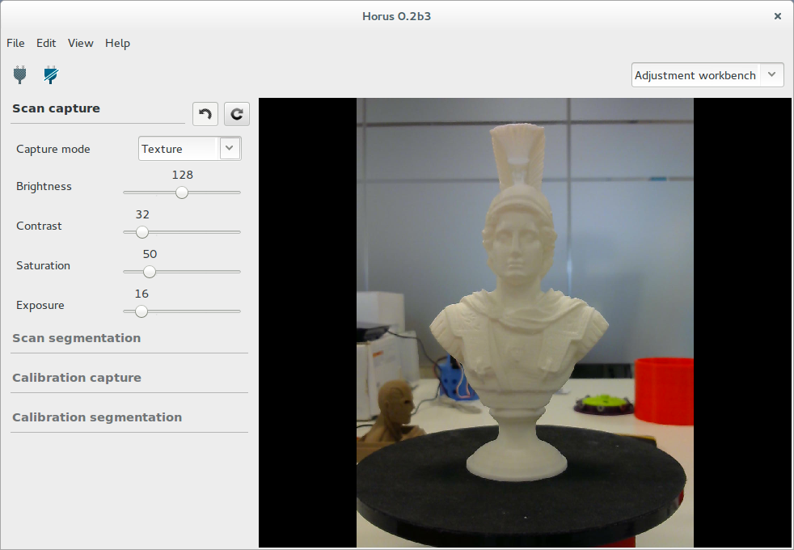
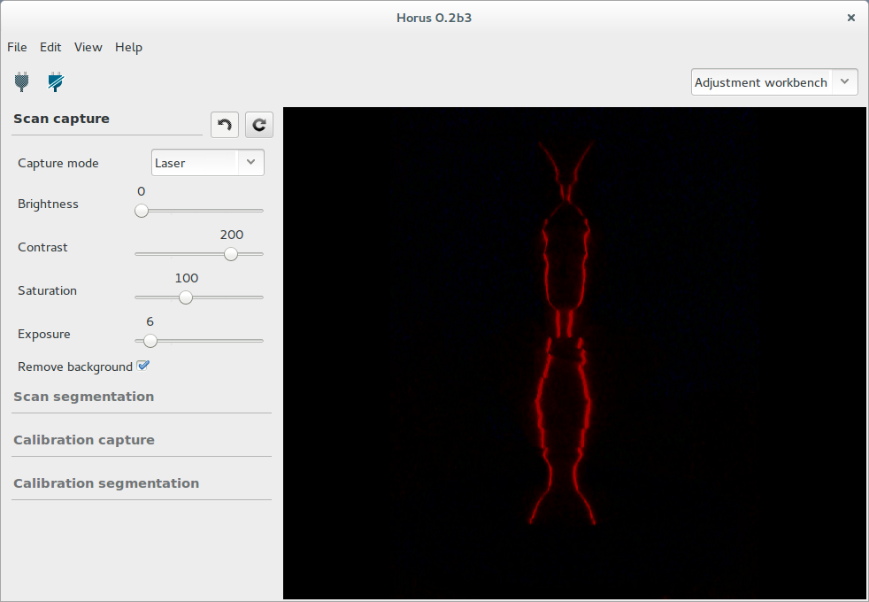
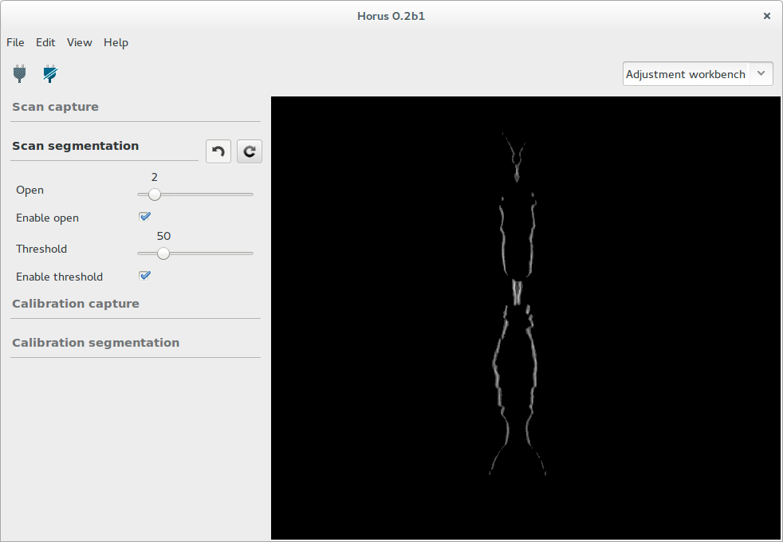
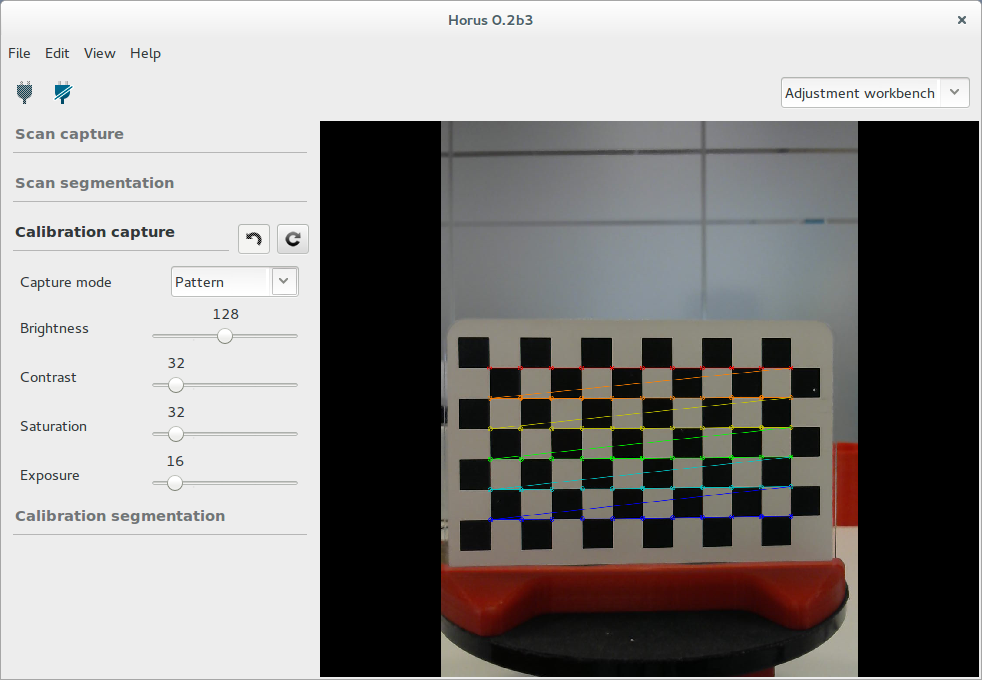
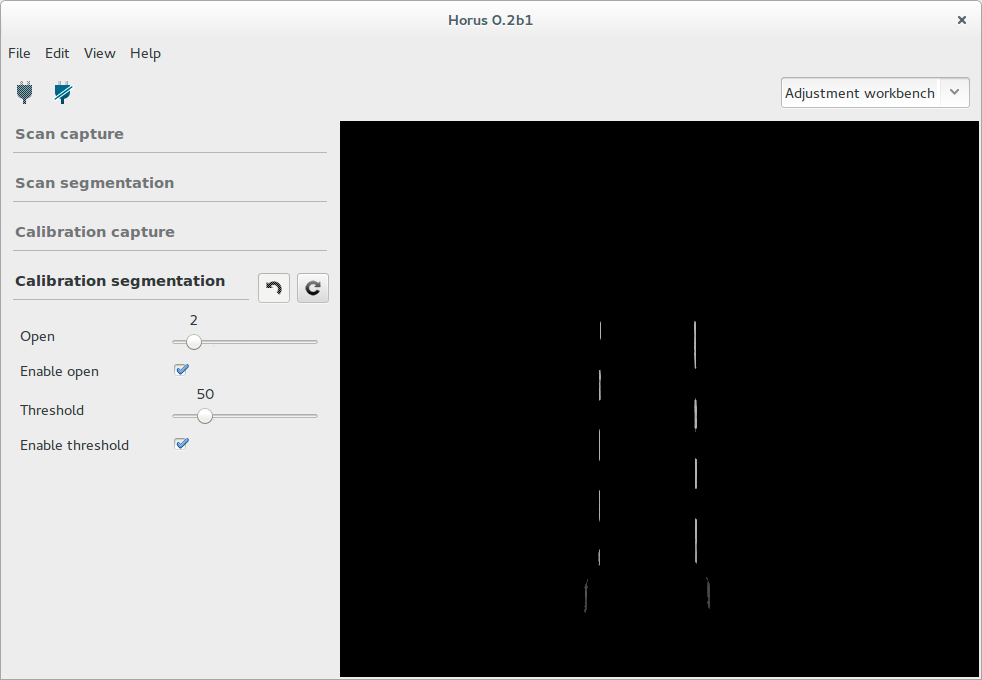

.. _sec-ajuste:

Ajuste
======

En este banco de trabajo se ajustan los parámetros de captura de la cámara y procesamiento de imagen para los distintos estados en los que  puede estar el sistema. En todo momento se pueden observar los cambios de los ajustes en el video.

Ajustes de escaneado
--------------------

Estos ajustes se aplican durante el proceso de escaneado.

Captura
~~~~~~~

En esta sección se ajustan los parámetros correspondientes a la captura durante el proceso de escaneado. Estos parámetros de deben ajustar con el objeto a escanear.

El "modo textura" contiene los parámetros que utilizará el escáner para capturar la textura o color del objeto. Éstos son: brillo, contraste, saturación y exposición.

El "modo láser" contiene los parámetros que utilizará el escáner para capturar y detectar el láser. Estos son: brillo, contraste, saturación, exposición y eliminación del fondo. La opción "eliminar fondo" facilita la detección de los láser a costa de consumir el doble de tiempo.

Segmentación
~~~~~~~~~~~~

En esta sección se ajusta la apertura y el umbral para la detección del láser durante el escaneado.

La opción de "open" elimina ruido de fondo a costa de perder resolución.

La opción de "threshold" fija un umbral de detección. Actúa también para eliminar ruido de fondo.

Ajustes de calibración
----------------------

Estos ajustes se aplican durante el proceso de calibración.

Captura
~~~~~~~

En esta sección se ajustan los parámetros correspondientes a la captura durante el proceso de calibración. Estos parámetros de deben ajustar con el patrón de calibración.

El "modo patrón" contiene los parámetros que utilizará el escáner para detectar correctamente el patrón. Éstos son: brillo, contraste, saturación y exposición.

El "modo láser" contiene los parámetros que utilizará el escáner para capturar y detectar el láser sobre el patrón. Éstos son: brillo, contraste, saturación, exposición y eliminación del fondo. La opción "eliminar fondo" facilita la detección de los láser a costa de consumir el doble de tiempo.

.. image:: ../images/adjustment-calibration-capture-laser.png

Segmentación
~~~~~~~~~~~~

En esta sección se ajusta la apertura y el umbral para la detección del láser durante la calibración.

La opción de "open" elimina ruido de fondo a costa de perder resolución.

La opción de "threshold" fija un umbral de detección. Actúa también para eliminar ruido de fondo.

