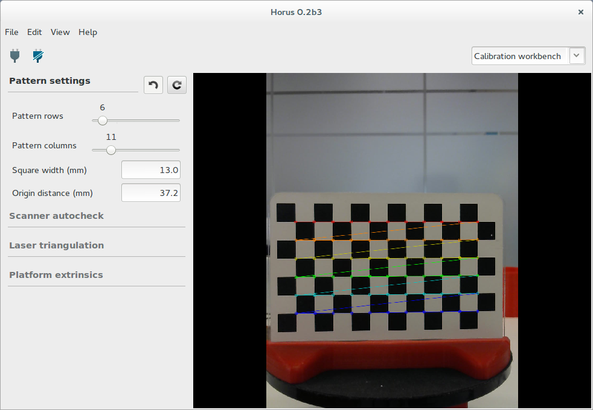
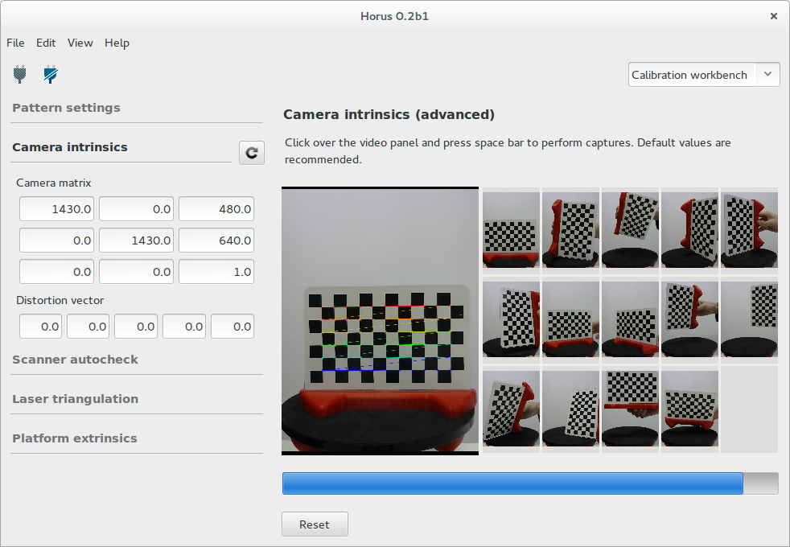
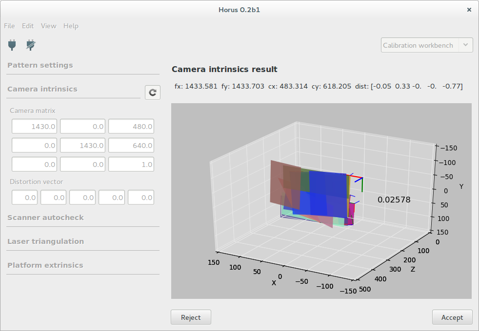
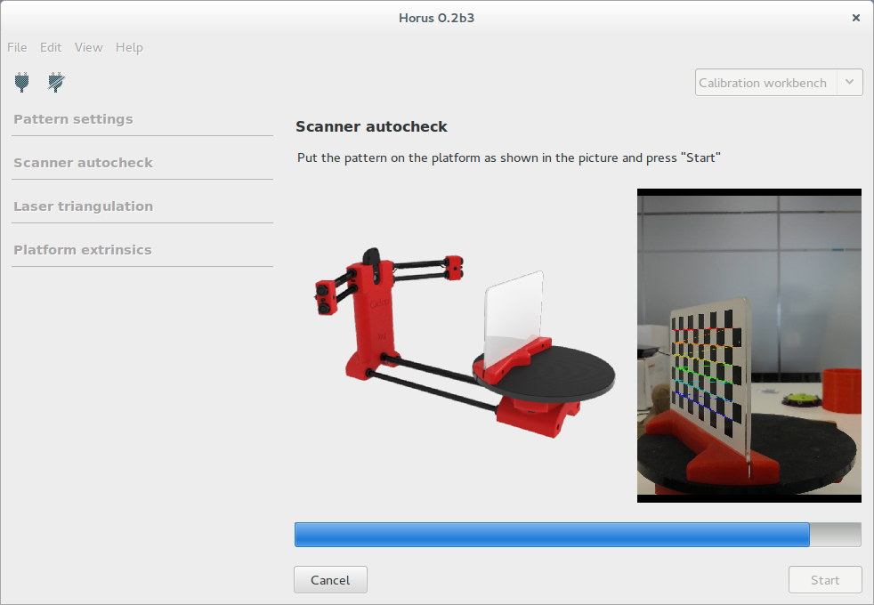
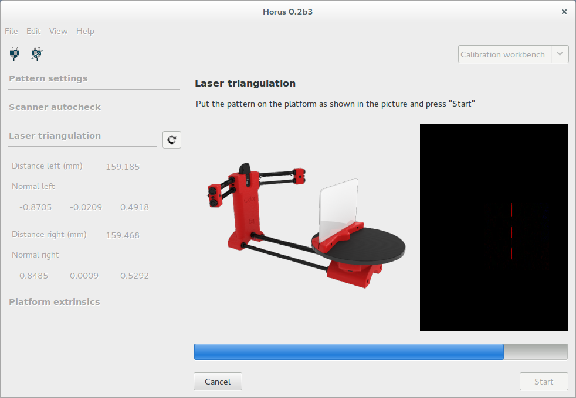
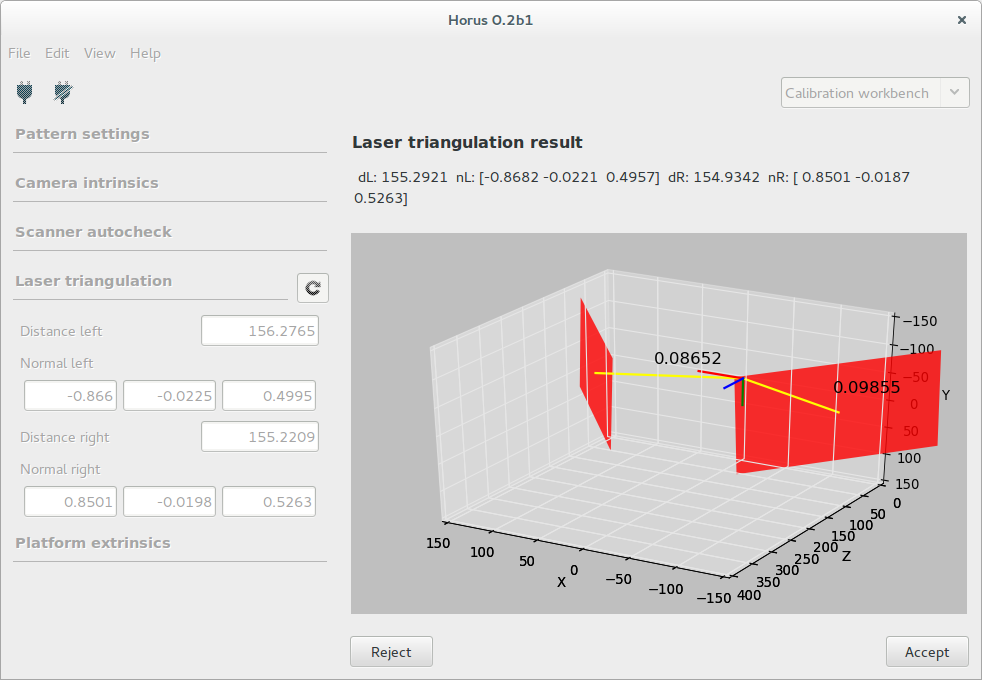
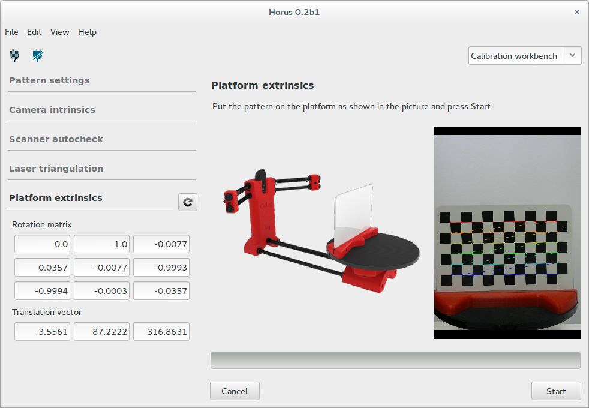
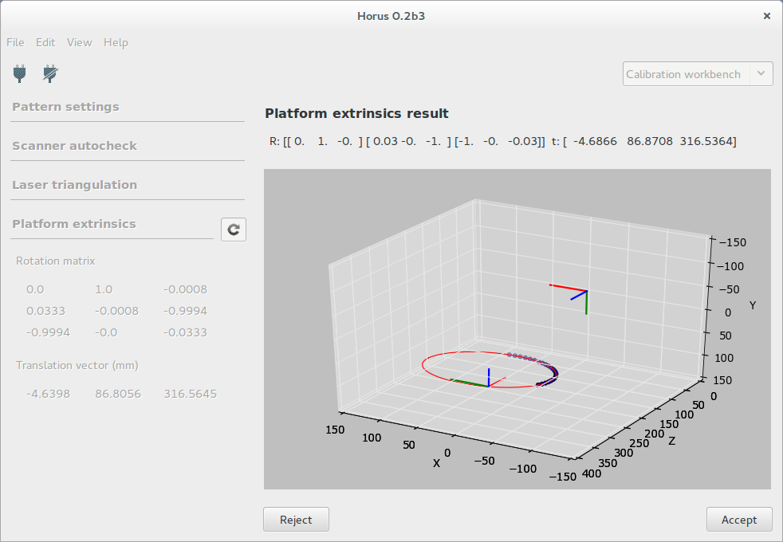

.. _sec-calibracion:

Calibración
===========

En este banco de trabajo se realizan todos los procesos de calibración del escáner.

Ajustes del patrón
------------------

En esta sección se configuran las características del patrón de calibración. Éstas son:

* El número de filas y columnas de vértices en el patrón. Por defecto son 6 y 11.
* El ancho del cuadrado en milímetros. Por defecto son 13 mm.
* La distancia al origen del patrón. Es la distancia de la base a la esquina inferior izquierda del patrón. No tiene valor por defecto ya que depende de cómo se haya colocado la pegatina. Es recomendable medirla con un calibre con precisión de 0.1 mm.

Calibración de la cámara
------------------------

Esta sección es avanzada. Se recomienda utilizar los valores por defecto. Al modificar los valores en esta calibración es preciso realizar las posteriores calibraciones.

Para ejecutar esta calibración se captura el patrón en distintas posiciones con la tecla "escape". Al completar todas las capturas se procede a la calibración de forma automática. En cualquier momento se pueden resetear las capturas tomadas anteriormente.

Finalmente se muestra el resultado de forma numérica y representado en 3D. Se puede Aceptar o Rechazar el resultado de la calibración.

Auto-comprobación
-----------------

En esta sección se ejecuta el proceso de auto comprobación en el que se detecta si el patrón, el motor y los láseres están configurados correctamente.

El patrón se debe colocar como se indica en la figura. Si la auto comprobación finaliza con éxito, el patrón se colocará perpendicular a la cámara.

Calibración de los láseres
--------------------------

En esta sección se determinan los planos que forman cada uno de los láseres con respecto al centro óptico de la cámara. Cada plano se define mediante la normal del plano y la distancia mínima al origen de coordenadas.

Para comenzar la calibración hay que colocar el patrón perpendicular a la cámara, tal y como se muestra en la figura. En cualquier momento se puede cancelar la calibración y el patrón se colocará en su posición inicial.

Finalmente se muestra el resultado de forma numérica y representado en 3D. Adjunto a cada plano se representa la dispersión de los puntos capturados durante la calibración. Éste valor debe ser menor que 0.1 mm. Se puede Aceptar o Rechazar el resultado de la calibración.

Calibración de la plataforma
----------------------------

En esta sección se determina la matriz de transformación homogénea del centro de rotación de la plataforma giratoria con respecto al centro óptico de la cámara. Esto consiste en una matriz de rotación y un vector de traslación en unidades de milímetros.

Para comenzar la calibración hay que colocar el patrón perpendicular a la cámara, tal y como se muestra en la figura. En cualquier momento se puede cancelar la calibración y el patrón se colocará en su posición inicial.

Finalmente se muestra el resultado de forma numérica y representado en 3D. Adjunto a cada plano se representa la dispersión de los puntos capturados durante la calibración. Se puede Aceptar o Rechazar el resultado de la calibración.

