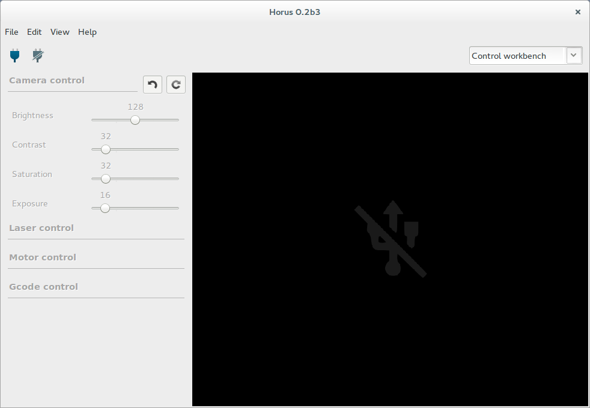
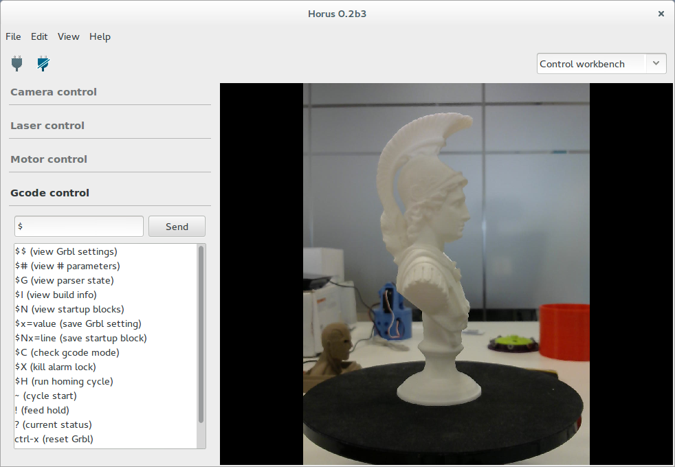

.. _sec-control:

Control
=======

En este banco de trabajo sirve para probar los componentes del escáner: cámara, láseres y motor.

Cámara
------

En esta sección se puede ajustar el brillo, contraste, saturación y exposición de la cámara. Éstos valores sólo afectan a este banco de trabajo.

También se puede modificar la tasa de refresco, resolución y distorsión de la cámara. Éstos valores sí que afectan al resto de los bancos de trabajo.

.. image:: ../images/control-camera.png

Láser
-----

En esta sección se pueden encender y apagar los dos láseres.

.. image:: ../images/control-laser.png

Motor
-----

En esta sección se puede mover el motor sintonizando el ángulo del movimiento, su velocidad y aceleración. Éstos valores sólo afectan a este banco de trabajo.

Gcode
-----

Esta sección presenta una terminal que permite comunicarse con el firmware por medio de comandos Gcode.

