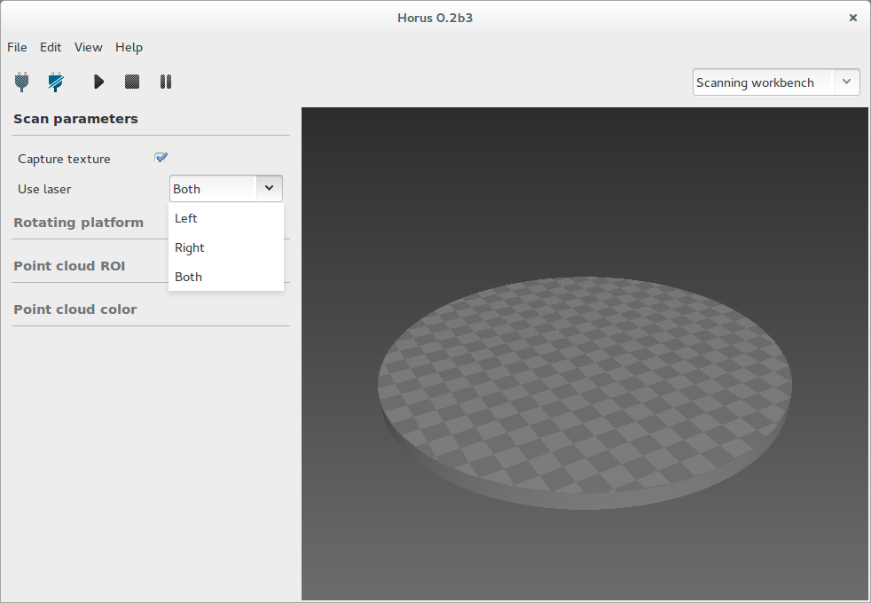
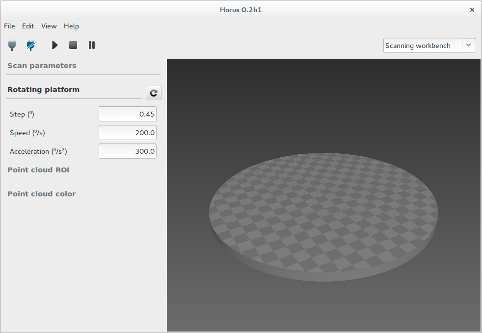
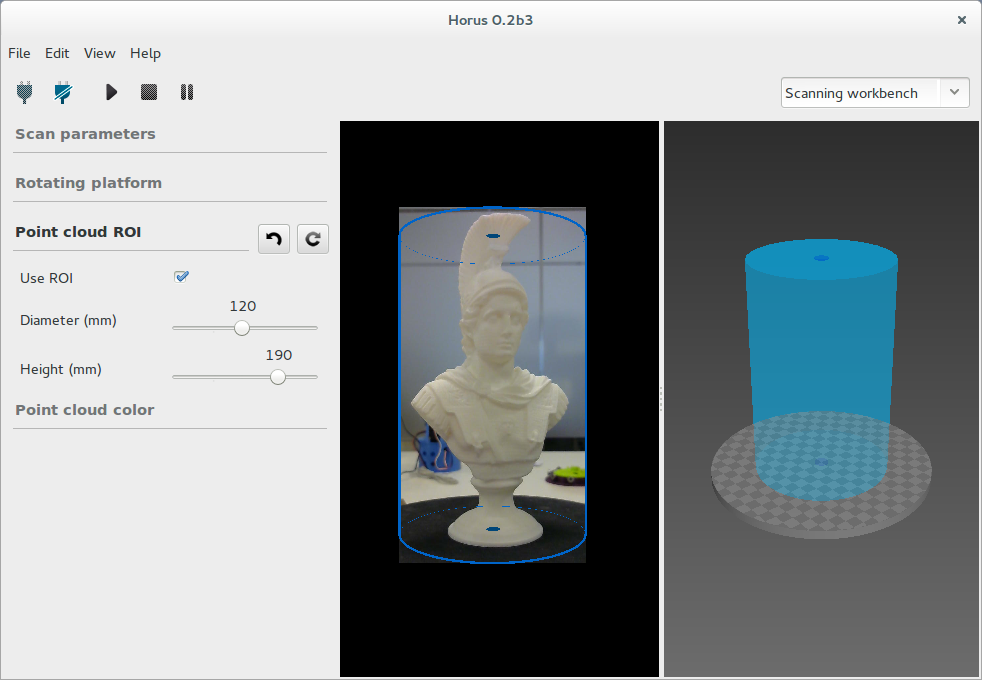
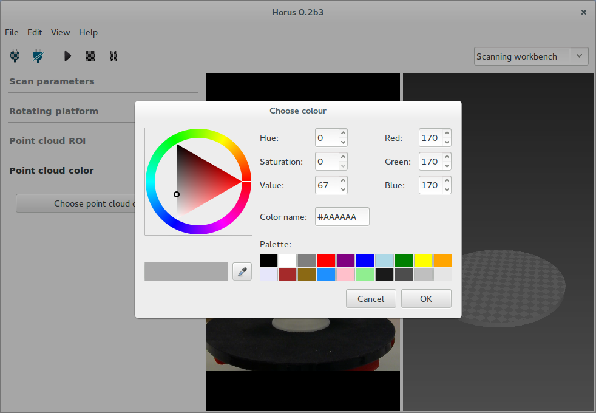
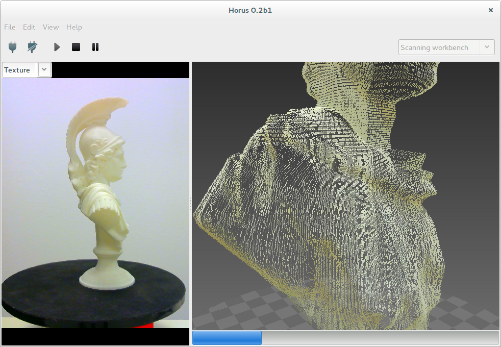
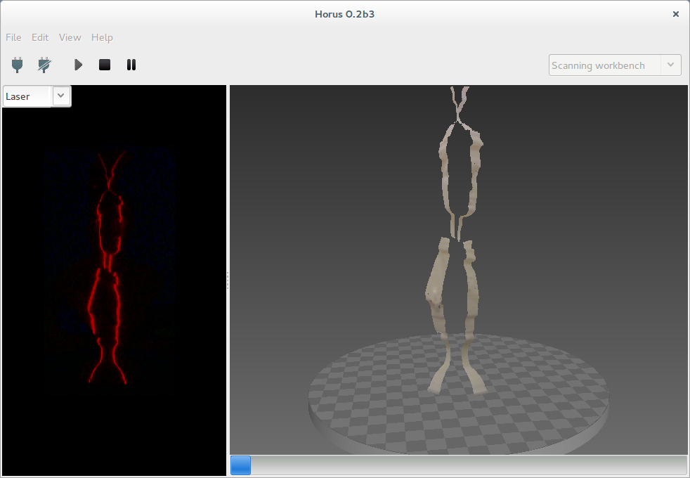
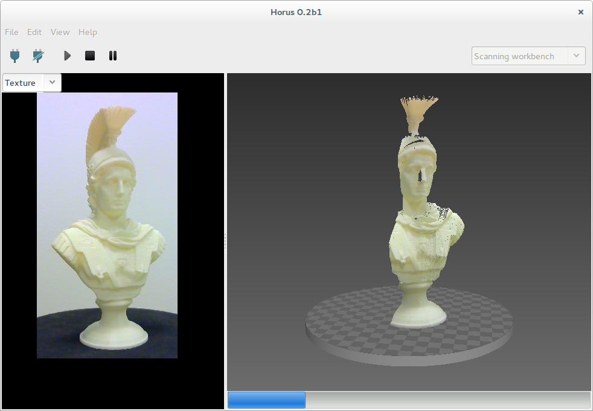

.. _sec-escaneo:

Escaneado
=========

En este banco de trabajo se realiza el proceso de escaneado. Este proceso consiste en la digitalización de un objeto físico en una nube de puntos en tres dimensiones.

El banco de trabajo tiene tres componentes:

* Panel de parámetros
* Ventana de video
* Escena 3D

Mediante el menu "View" se pueden mostrar y ocultar estos paneles.

Panel de parámetros
-------------------

Parámetros del escaneo
~~~~~~~~~~~~~~~~~~~~~~

* Captura de textura: indica si capturar o no la textura o color del objeto real. Si no se captura la textura el proceso es, naturalmente, más rápido. El color asignado a la nube de puntos, en este caso, viene definido por la última sección de este panel.

* Uso de los láseres: se puede seleccionar el uso de uno o dos láseres para el escaneado.

Parámetros de la plataforma
~~~~~~~~~~~~~~~~~~~~~~~~~~~

* Paso: es el ángulo que avanza el motor en cada iteración de escaneado. Cuanto menor sea, mayor será la resolución radial, así como el tiempo de escaneao. El valor por defecto es 0.45º, que se corresponde con 800 pasos por vuelta.

* Velocidad: es la velocidad con la que avanza el motor en grados por segunto.

* Aceleración: es la aceleración del motor en grados por segundo al cuadrado.

ROI de la nube de puntos
~~~~~~~~~~~~~~~~~~~~~~~~

En esta sección se define la ROI, o zona de interés de la nube de puntos. Esta zona está constituida por un volumen cilíndrico y paramétrico.

Al seleccionar el uso de la ROI, se aplican dos filtros durante el escaneado:

* Filtro en el video: se aplica una máscara con la proyección del volumen de la ROI en la imagen. De este modo sólo se captura lo que está dentro de este área.

* Filtro de la nube de puntos: también se aplica el filtro a la nube de puntos para almacenar únicamente los puntos que estén en el interior del volumen.

Color de la nube de puntos
~~~~~~~~~~~~~~~~~~~~~~~~~~

En esta sección se selecciona el color de la nube de puntos para el caso en el que no se captura textura del objeto.

NOTA: este panel se oculta durante el proceso de escaneado.

Ventana de video
----------------

En esta ventana se distingen dos estados. Mientras no se está escaneando se muestra el video de la cámara con los ajustes de captura de textura. Durante el escaneo se pueden seleccionar varias vistas que corresponden con distintas fases del procesamiento de imagen:

* Textura
* Láser
* Gris
* Línea

.. image:: ../images/scanning-video-gray.png

Escena 3D
---------

Consiste en una escena tridimensional donde se visualiza la nube de puntos escaneada o modelo. También permite visualizar mallas en STL.

Se puede navegar en el visualizador 3D mediante los siguientes accesos rápidos:

+----------------------------------+--------------------------------+-----------------------+
|   Acción                         | Acceso rápido 1                | Acceso rápido 2       |
+==================================+================================+=======================+
| Vistas predeterminadas           | Inicio / AvPag / RePag / Fin   |                       |
+----------------------------------+--------------------------------+-----------------------+
| Rotación                         | Clic izquierdo                 | Shift + Arriba/Abajo  |
+----------------------------------+--------------------------------+-----------------------+
| Rotación horizontal              | Arriba/Abajo                   |                       |
+----------------------------------+--------------------------------+-----------------------+
| Rotación vertical                | Izquierda/Derecha              |                       |
+----------------------------------+--------------------------------+-----------------------+
| Desplazamiento vertical          | Ctrl + Rueda ratón             | Ctrl + Arriba/Abajo   |
+----------------------------------+--------------------------------+-----------------------+
| Resetear desplazamiento vertical | Doble clic izquierdo           |                       |
+----------------------------------+--------------------------------+-----------------------+
| Traslación                       | Shift + Clic Izquierdo         |                       |
+----------------------------------+--------------------------------+-----------------------+
| Zoom                             | Rueda ratón                    | Shift + Arriba/Abajo  |
+----------------------------------+--------------------------------+-----------------------+
| Eliminar objeto                  | Clic derecho + Eliminar objeto | Supr                  |
+----------------------------------+--------------------------------+-----------------------+

Durante el proceso de escaneado se muestra en la parte inferior una barra de progreso:

Para cargar, guardar o resetear el modelo, se accede desde el menú "File".
