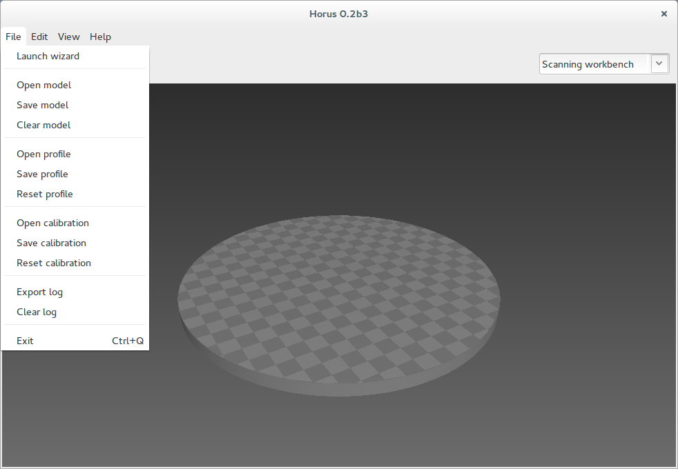
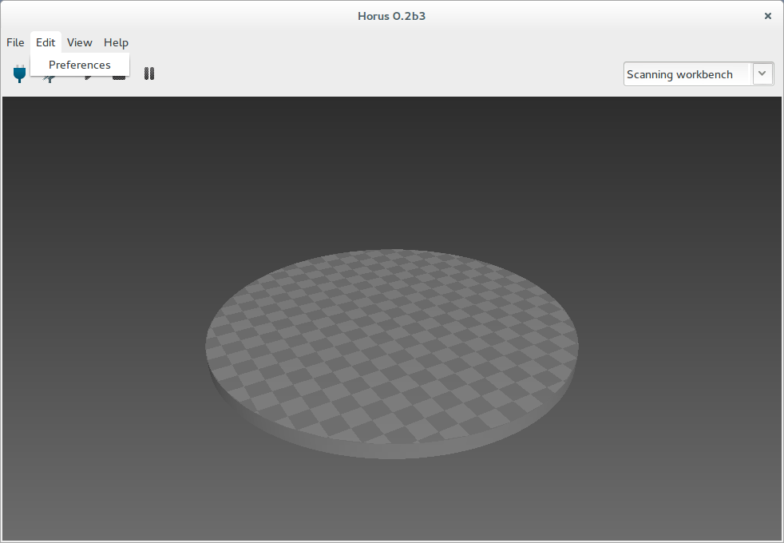
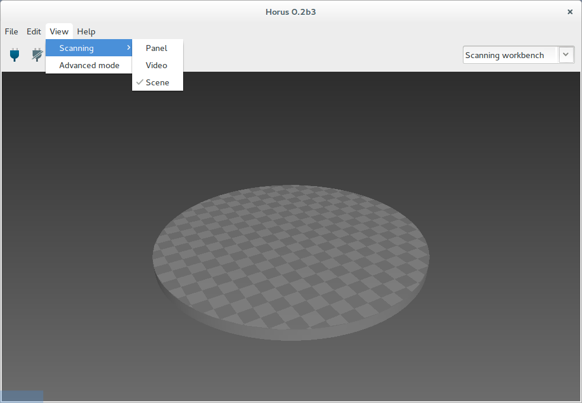
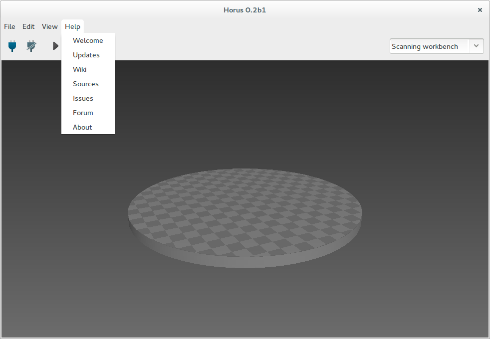
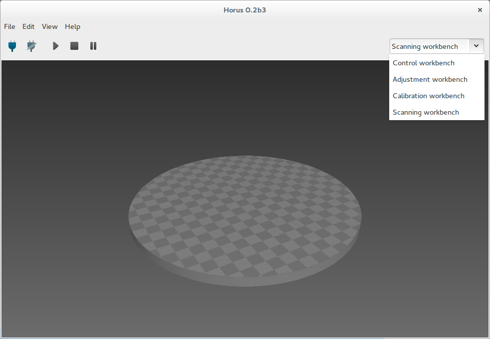

.. _sec-menu:

Menu
====

File
----

* Lanzar wizard: abre la ventana de wizard.

* Cargar modelo: permite visualizar una nube de puntos en PLY o una malla en STL.

* Guardar modelo: guarda la nube de puntos de la escena 3D en formato PLY.

* Borrar modelo: elimina el modelo de la escena 3D.

* Abrir perfil: carga todos los parámetros de control, ajuste y escaneo.

* Guardar perfil: guarda en formato JSON todos los parámetros de control, ajuste y escaneo, a excepción de la calibración.

* Resetear perfil: resetea al valor por defecto todos los parámetros de control, ajuste y escaneo, a excepción de la calibración.

* Abrir calibración: carga todos los parámetros de calibración.

* Guardar calibración: guarda en formato JSON todos los parámetros de calibración.

* Resetear calibración: resetea al valor por defecto todos los parámetros de calibración.

* Salir: finaliza la ejecución del programa.

Edit
----

* Preferencias: abre la ventana de preferencias. En esta ventana se seleccionan los parámetros de conexión, permite la carga del firmware en la electrónica del escáner, cambiar de idioma y seleccionar la opción de invertir motor.

View
----

Este menú permite seleccionar las ventanas visibles en el banco de trabajo de escaneado. Estas son el panel de configuración, el video y la escena 3D.

Help
----

El menú de ayuda se puede abrir la ventana de bienvenida, comprobar actualizaciones y acceder a los recursos web del proyecto.

Combo
-----

Con este combo se seleccionan los distintos bancos de trabajo.

