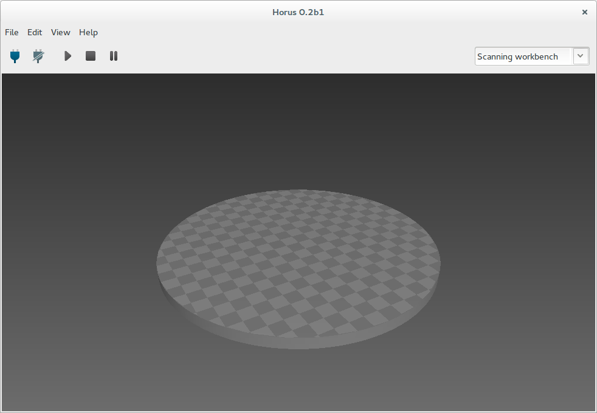
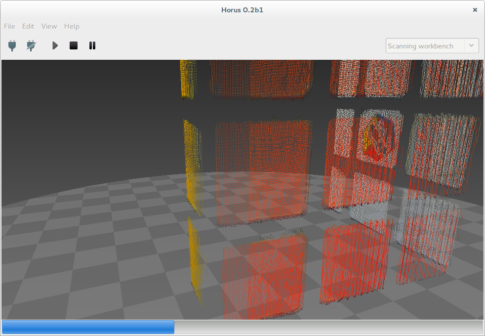
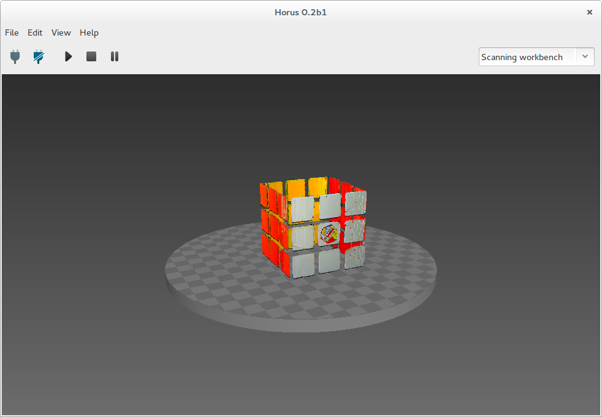

.. _sec-escaneado:

Escaneado
=========

Esta es la ventana principal del banco de trabajo de escaneo.

Para escanear hay que pulsar el botón de "Play". También se puede detener, pausar y reanudar el escaneo.

Durante el escaneo se muestra el progreso en la parte inferior de la escena.

Se puede navegar en el visualizador 3D mediante los siguientes accesos rápidos:

+----------------------------------+--------------------------------+-----------------------+
|   Acción                         | Acceso rápido 1                | Acceso rápido 2       |
+==================================+================================+=======================+
| Vistas predeterminadas           | Inicio / AvPag / RePag / Fin   |                       |
+----------------------------------+--------------------------------+-----------------------+
| Rotación                         | Clic izquierdo                 | Shift + Arriba/Abajo  |
+----------------------------------+--------------------------------+-----------------------+
| Rotación horizontal              | Arriba/Abajo                   |                       |
+----------------------------------+--------------------------------+-----------------------+
| Rotación vertical                | Izquierda/Derecha              |                       |
+----------------------------------+--------------------------------+-----------------------+
| Desplazamiento vertical          | Ctrl + Rueda ratón             | Ctrl + Arriba/Abajo   |
+----------------------------------+--------------------------------+-----------------------+
| Resetear desplazamiento vertical | Doble clic izquierdo           |                       |
+----------------------------------+--------------------------------+-----------------------+
| Traslación                       | Shift + Clic Izquierdo         |                       |
+----------------------------------+--------------------------------+-----------------------+
| Zoom                             | Rueda ratón                    | Shift + Arriba/Abajo  |
+----------------------------------+--------------------------------+-----------------------+
| Eliminar objeto                  | Clic derecho + Eliminar objeto | Supr                  |
+----------------------------------+--------------------------------+-----------------------+

Una vez finalizado el proceso de escaneado, el objeto se guarda en "Fichero > Guardar modelo". Éste se almacena en formato ply.

