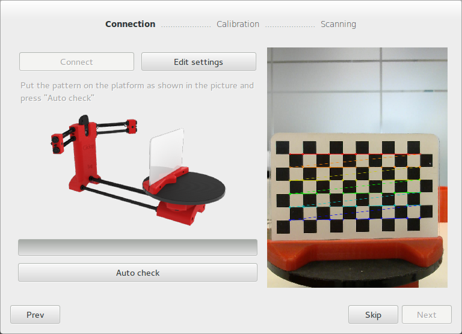
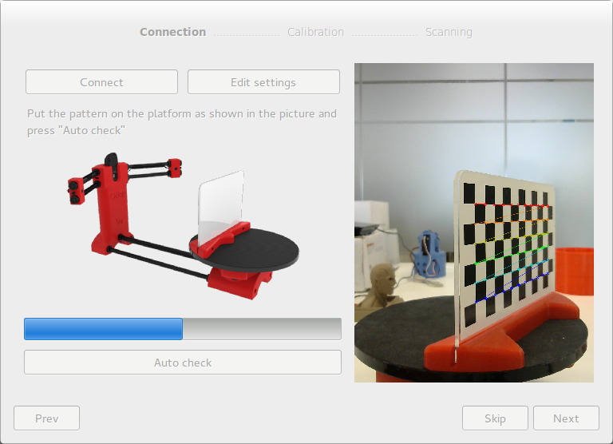
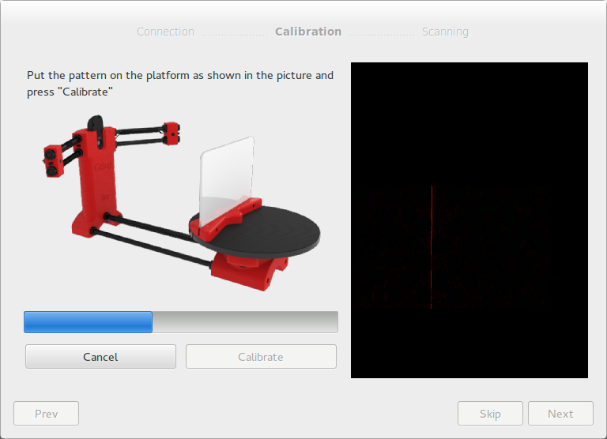
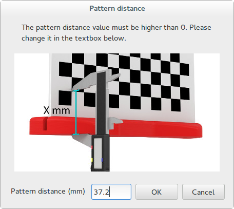
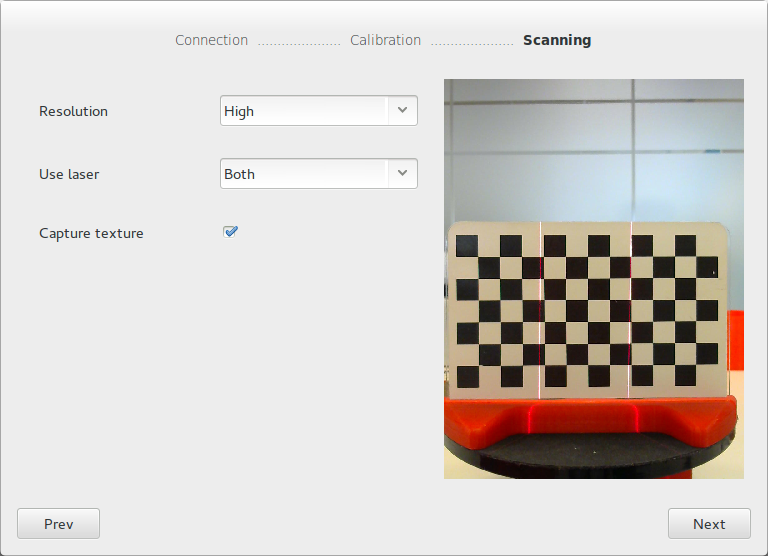

.. _sec-wizard:

Wizard
======

Al abrir por primera vez Horus, aparece una ventana de bienvenida. Esta ventana tiene dos partes:

* Crear nuevo: permite lanzar el Wizard o cada uno de los bancos de trabajo.
* Abrir reciente: proporciona un acceso directo a los modelos (ply o stl) abiertos o creados anteriormente.

.. figure:: ../images/welcome.png

Pulsando sobre "Wizard" se abre el menú interactivo en el que se configura el escáner paso a paso.

Ventana de conexión
-------------------

En esta ventana se realiza la conexión del escáner, el ajuste de la luminosidad y el proceso de autocomprobación.

* Conectar: conecta la cámara y la electrónica de Ciclop. Si no encuentra alguno de los dispositivos se genera una notificación informativa.

* Editar ajustes: este botón despliega una ventana en la que se puede ajustar la exposición de la cámara en función de la luminosidad de la escena. Una luminosidad alta implica una menor exposición en la cámara y viceversa.

* Auto-comprobación: para realizar este proceso es necesario colocar el patrón correctamente sobre la plataforma, como indica la figura. Este proceso realiza una vuelta completa de la plataforma determinando:

  * Detección del patrón: indica si el patrón no se ha detectado correctamente por problemas de luminosidad o brillo.
  * Dirección del motor: detecta si el motor ha sido conectado al revés e indica cómo corregirlo.
  * Detección de los láseres: detecta si los láserses han sido conectados correctamente y están operativos.

**Nota**: la primera vez que se pulsa auto-comprobación, indica si se desean alinear los láseres. Esto es para modificar manualmente la orientación de los láseres hasta que emitan una línea perpendicular a la plataforma.

Ventana de calibración
----------------------

En esta ventana se realiza de forma conjunta la calibración de los láseres y la plataforma giratoria.

Esta calibración determina automáticamente los planos en el espacio de cada uno de los láseres con respecto a la cámara, así como la relación espacial entre la plataforma giratoria y el centro óptico de la cámara.

La primera vez se ejecuta el proceso de calibración, hay que introducir la "Distancia al origen del patrón", como se indica en la imagen. Esta distancia es fundamental para la calibración de la plataforma, ya que indica la relación entre la posición de la pegatina del patrón y la base.

Ventana de escaneo
------------------

En esta ventana se ajustan los parámetros de escaneo:

* Resolución: está relacionada con el número de pasos por vuelta del motor.

  * Alta: 800 pasos (0.45º)
  * Media: 400 pasos (0.9º)
  * Baja: 200 pasos (1.8º)

* Laser: se selecciona el láser izquierdo, derecho o ambos.

Al completar el Wizard se accede a la ventana principal.
