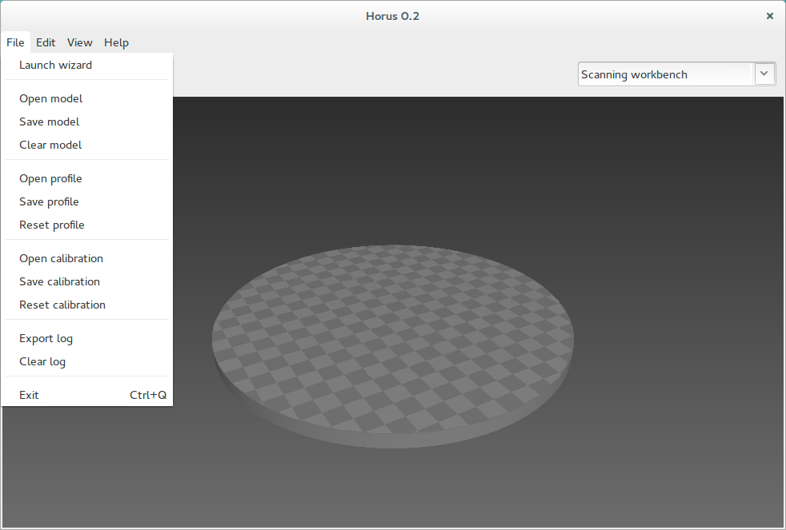
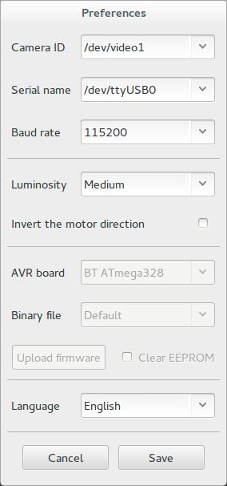
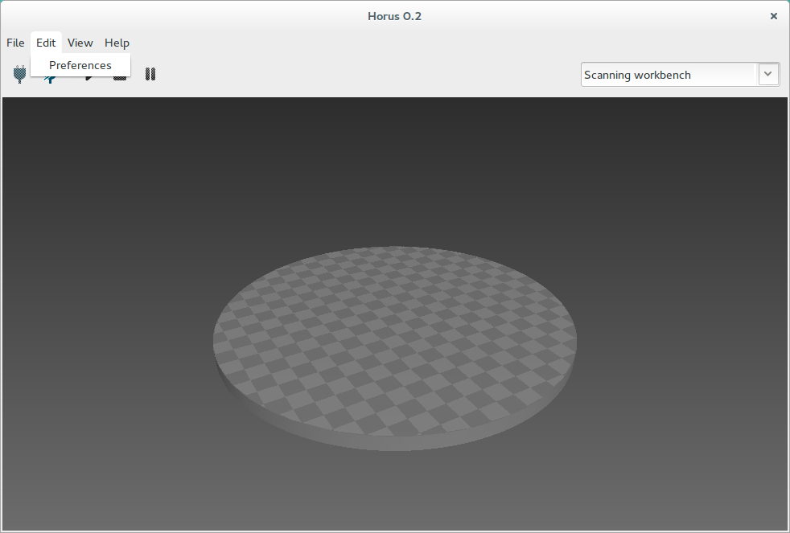
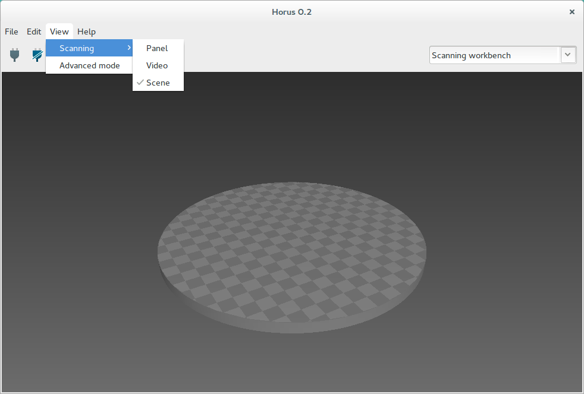
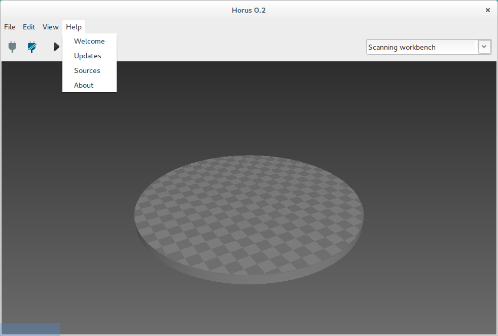
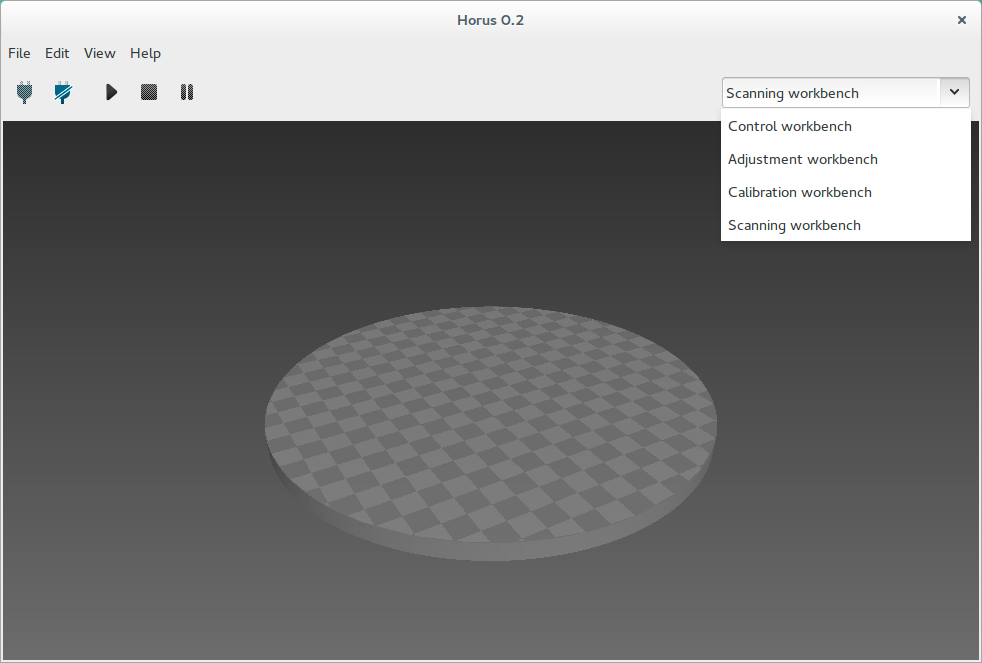

.. _sec-getting-started-menu:

Menu
====

File
----

* **Launch wizard**: opens the *Wizard*.
* **Open model**: opens a 3D model (*ply* point cloud or *stl* mesh).
* **Save model**: saves the point cloud of the 3D scene in *ply* format.
* **Clear model**: removes the current 3D model from the 3D scene.
* **Open profile**: loads all the control, adjustment and scanning parameters.
* **Save profile**: saves all the control, adjustment and scanning parameters in JSON format.
* **Reset profile**: resets all the control, adjustment and scanning parameters to the default values.
* **Open calibration**: loads all the calibration parameters.
* **Save calibration**: saves all the calibration parameters in JSON format.
* **Reset calibration**: resets all the calibration parameters to the default values.
* **Export log**: saves a log file with the registry of the previous commands.
* **Clear log**: removes the log file. It is automatically removed each 7 days.
* **Exit**: closes the application.

Edit
----

* **Preferences**: opens the complete preferences window:

   * **Connection section**: *Camera ID*, *Serial name* and *Baud rate*.
   * **Adjustment section**: *Luminosity* and *Invert the motor direction*.
   * **Firmware section**: allows to upload the default or a selected firmware to *BT ATmega328* and *Arduino UNO* boards. Also, it can clear EEPROM before uploading the firmware.
   * **Language section**: allows to select the application's current language.

.. note::

   The *Firmware section* is only enabled if the scanner is disconnected.

View
----

This menu shows and hides the *Scanning workbench* panels: the configuration panel, the video and the 3D scene.

It also contains the *Advanced mode* option, that enables advanced options in *Calibration workbench*.

Help
----

In this menu you can open the *Welcome* window, check for updates and to access to project's web resources.

Workbench combo box
-------------------

With this combo box, the current workbench is selected.

