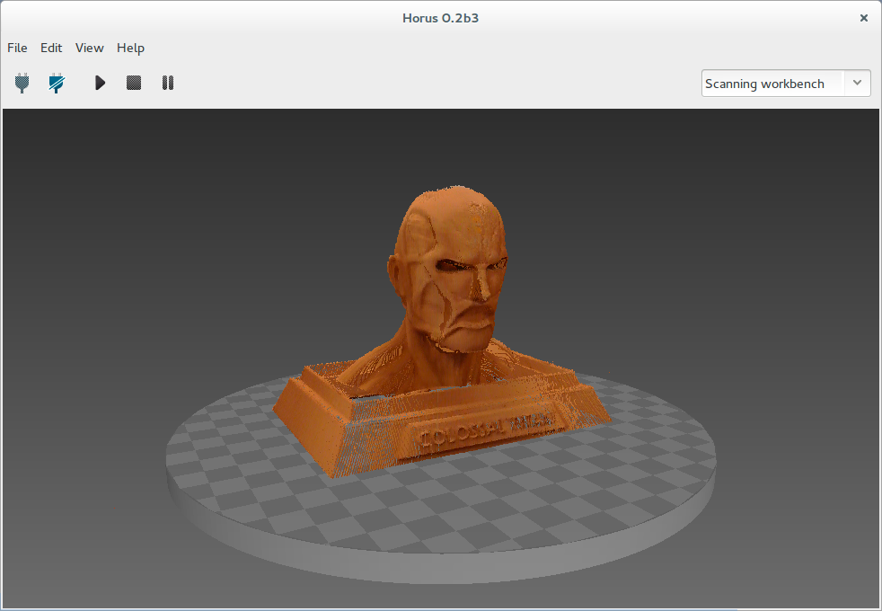

.. _sec-getting-started-scanning:

Scanning
========

.. image:: ../_static/getting-started/main-window.png

To start scanning press the *Play* button. Also the process can be stopped, paused and resumed.

During the scanning, the progress is shown in the bottom of the scene.

.. image:: ../_static/getting-started/scanning.png

You can navigate in the 3D scene using the following shortcuts:

.. list-table::
   :widths: 1 1 1

   * - **Action**
     - **Shortcut 1**
     - **Shortcut 2**
   * - Default views
     - Home / PgUp / PgDn / End
     -
   * - Rotate
     - Left click
     - Shift + Up/Down
   * - Rotate horizontally
     - Up / Down
     -
   * - Rotate vertically
     - Left / Right
     -
   * - Vertical shift
     - Ctrl + Mouse wheel
     - Ctrl + Up / Down
   * - Reset vertical shift
     - Dobule left click
     -
   * - Traslation
     - Shift + Left click
     -
   * - Zoom
     - Mouse wheel
     - Shift + Up /Down
   * - Delete object
     - Right click + Delete object
     - Del
   * - Quit program
     - Ctrl + Q
     -

Upon completion of the scanning process, the object can be saved in *File > Save model*. The point cloud is saved in *ply* format.

