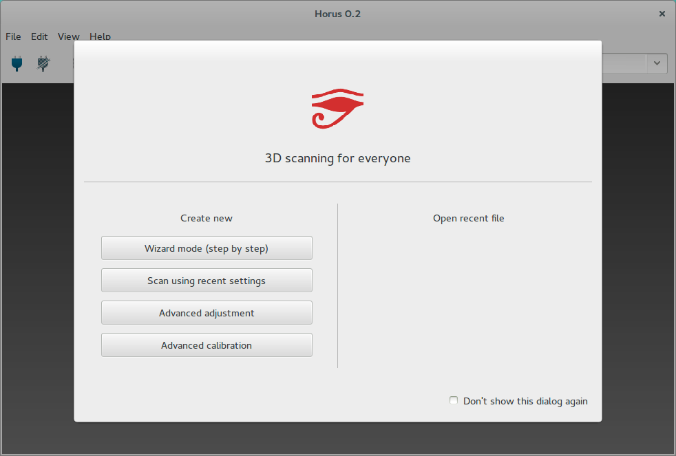
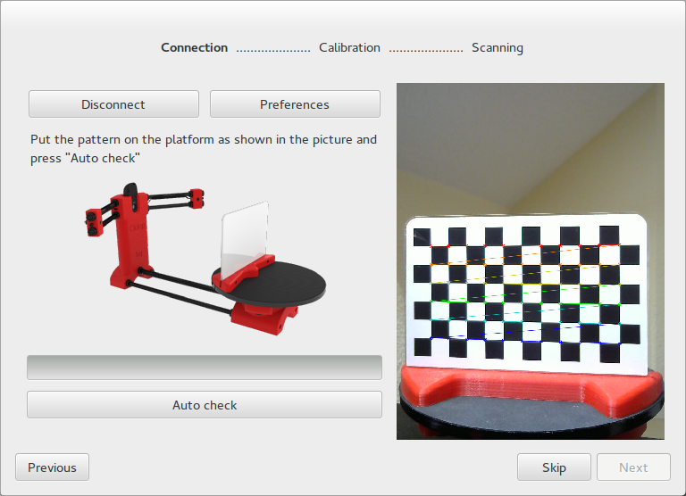
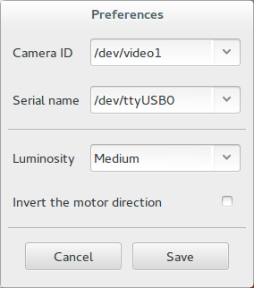
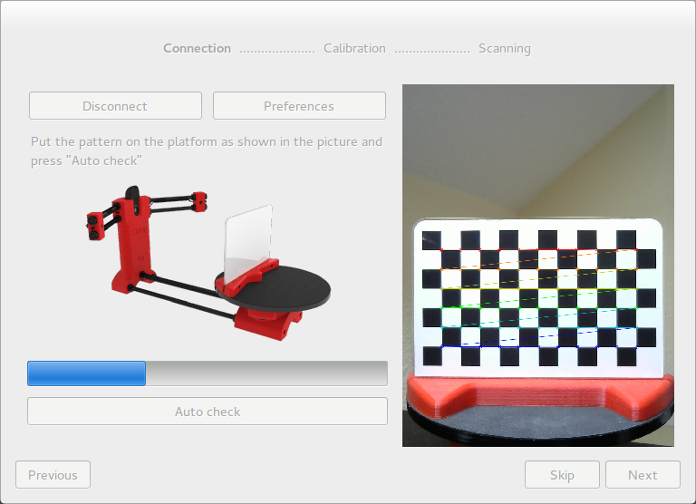
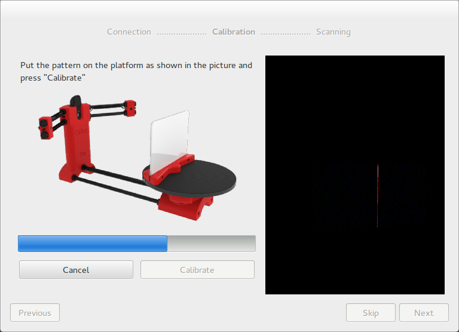
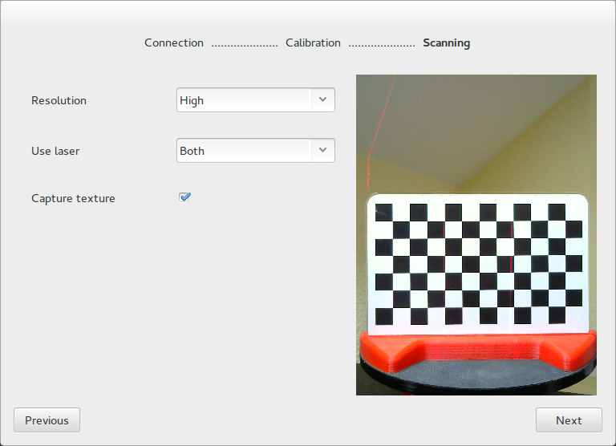

.. _sec-getting-started-wizard:

Wizard
======

When you first open *Horus*, a **Welcome** window appears. This windows has two parts:

* **Create new**: it allows to launch the Wizard or any workbench.
* **Open recent file**: it provides direct access to the latest models (*ply* or *stl*).

Pressing over **Wizard mode**, an interactive menu appears for configuring the scanner step by step.

Connection window
-----------------

This window contains the scanner connection, a preferences panel and the auto check process.

* **Connect/Disconnect**: connects the camera and the electronics of Ciclop. If a device can not be found, a notification message is thrown.
* **Preferences**: allows to modify the *Camera ID* and the *Serial name* of the scanner. Also the *Luminosity*. This setting can take *High, Medium or Low* for high, medium of low ambient light. The setting *Invert the motor direction* inverts all the motor angle commands.

* **Auto check**: in order to perform this process, putting the pattern over the platform is required, as shown in the picture. This process makes a full turn of the platform, and checks:

  * **Pattern detection**: indicates whether the pattern is not detected correctly by luminosity or brightness problems.
  * **Motor direction**: detects if the motor direction is reversed and how to correct it.
  * **Lasers detection**: detects if the lasers have been connected properly and are working.

.. note::

   The first time *Auto check* is pressed, a menu appears indicating if the lasers want to be aligned. This is for manually moving the orientation of the lasers until the emitted line is perpendicular to the platform. It requires an Allen wrench.

Calibration window
------------------

In this windows both the lasers calibration and the platform calibration are performed.

This calibration process computes the planes in the space respect to the camera for each laser, as well as the spatial relation between the turntable and the optical center of the camera.

.. note::

   The first time the calibration is performed, *Origin pattern distance* must be set. This distance is fundamental for the platform's calibration, because it indicates the real relation between the position of the pattern's sticker and the base.

   .. image:: ../_static/getting-started/pattern-origin-distance.png
      :align: center
      :width: 456 px

Scanning window
---------------

In this window, scanning parameters are set:

* **Resolution**: it is related to the number of steps per revolution of the motor.

  * *High*: 800 steps (0.45º)
  * *Medium*: 400 steps (0.9º)
  * *Low*: 200 steps (1.8º)

* **Laser**: selects left laser, right laser or both.
* **Capture texture**: enabling this option captures the real color of the object. Otherwise the point cloud has an uniform fake color.

Once the **Wizard** is completed, access the main window.
