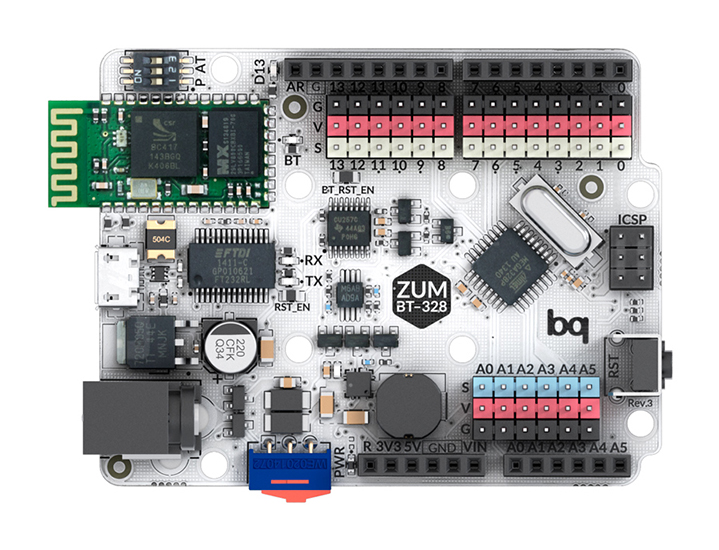

.. _sec-scanner-components-board:

Board
=====

Supported boards
----------------

ZUM BT-328
```````````



ZUM SCAN Shield
```````````````

.. image:: ../_static/scanner-components/zum-scan.jpg
   :width: 250 px


Horus Firmware
--------------

The firmware is an adaptation of Grbl. Source code is here: https://github.com/bqlabs/horus-fw.

It can be uploaded in **Preferences > Upload firmware**.

.. Troubleshooting
.. ---------------
