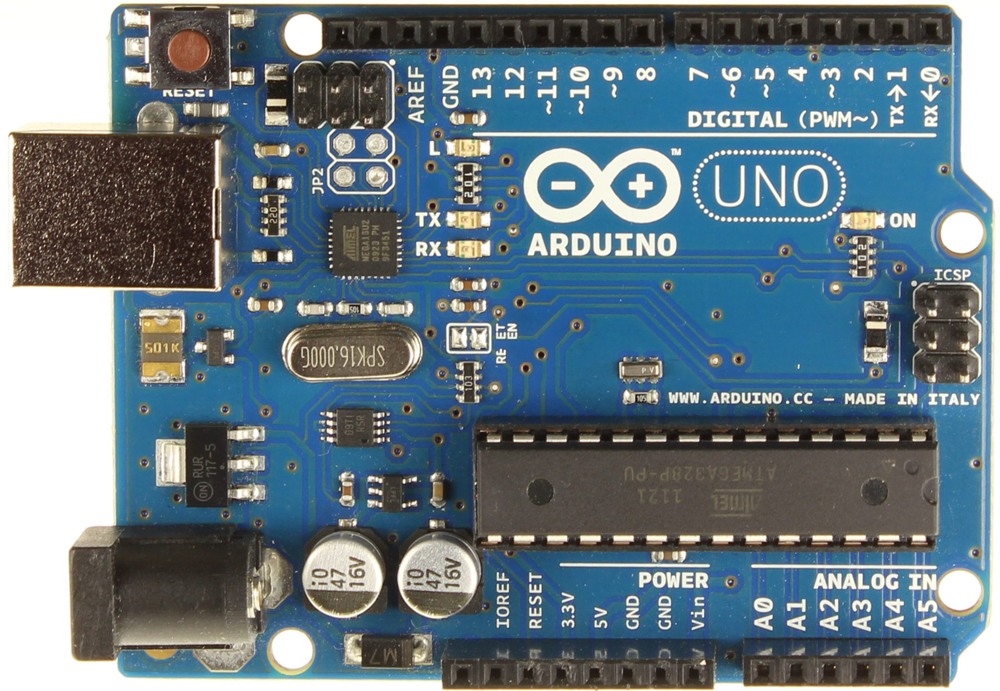

.. _sec-scanner-components-board:

Board
=====

Supported boards
----------------

ZUM BT-328
```````````

.. image:: ../_static/scanner-components/zum.jpg
   :width: 250 px

Arduino UNO
```````````



Supported shields
-----------------

ZUM SCAN
````````

.. image:: ../_static/scanner-components/zum-scan.jpg
   :width: 250 px


Horus Firmware
--------------

The firmware is an adaptation of Grbl. Releases are hosted here: https://github.com/bqlabs/horus-fw/releases.

It can be uploaded in **Preferences > Upload firmware**.

Troubleshooting
---------------

Board not detected
``````````````````

   Sometimes **Arduino UNO** board is not detected correctly, specially if you are using **Windows 10** or **strange clones**. First of all, follow this steps to ensure that your board and your operating system are working fine together:

   1. Follow this guide to install the drivers and the Arduino IDE: https://www.arduino.cc/en/Guide/Windows.
   2. Upload the `blink` example. If it doesn't work go to: https://forum.arduino.cc/ to find a solution.

   Then if the led is blinking is time to upload the Horus firmware. You have two options:

    - In Horus GUI, go to *Preferences*. Select your board and press *Upload firmware*.
    - In Arduino IDE, download the source code (https://github.com/bqlabs/horus-fw) and upload the file horus-fw.ino.

   .. hint::

      If you have any problem related to the board or the shield please put it here: https://github.com/bqlabs/horus/issues to update this manual.
