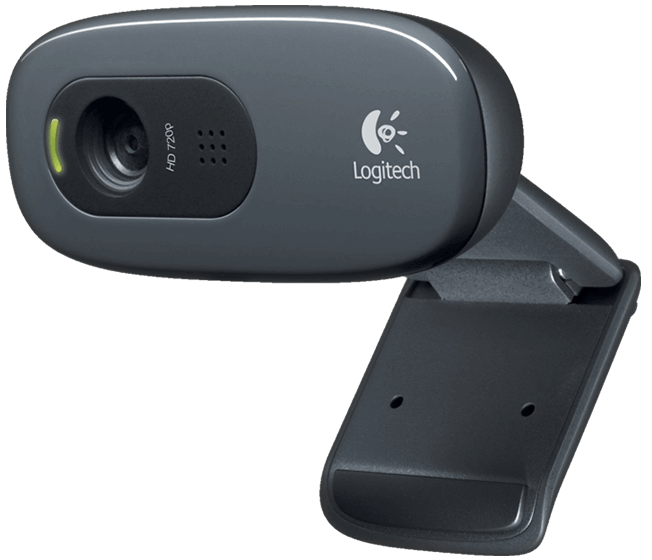

.. _sec-scanner-components-camera:

Camera
======

Supported cameras
-----------------

Logitech C270
`````````````



HD USB webcam with fixed focus.

.. list-table::
   :widths: 5 3 4

   * - **Name**
     - **Value**
     - **Setting**
   * - Width
     - 1280 px
     - ``camera_width``
   * - Height
     - 960 px
     - ``camera_height``
   * - Frame rate
     - 30 fps
     - ``frame_rate``
   * - Rotation
     - Yes
     - ``camera_rotate``
   * - Horizontal flip
     - Yes
     - ``camera_hflip``
   * - Vertical flip
     - No
     - ``camera_vflip``
   * - Focal length x
     - 1430 px
     - ``camera_matrix``
   * - Focal length y
     - 1430 px
     - ``camera_matrix``
   * - Optical center x
     - 480 px
     - ``camera_matrix``
   * - Optical center y
     - 620 px
     - ``camera_matrix``
   * - Distortion
     - No
     - ``use_distortion``

Image controls
--------------

.. list-table::
   :widths: 5 3 4

   * - **Name**
     - **Range**
     - **Setting**
   * - Brightness
     - 0-255
     - ``brightness_``
   * - Contrast
     - 0-255
     - ``contrast_``
   * - Saturation
     - 0-255
     - ``saturation_``
   * - Exposure
     - 1-64
     - ``exposure_``

These parameters have different values for each situation:

 * Capture texture
 * Pattern detection
 * Laser detection over the object
 * Laser detection over the pattern

Therefore, for each case the optimum values can be set.


Flush buffer
------------

OpenCV is used to manage the camera. It wraps all the functionality to allow easy access.

At the low level driver, each operating system has different behavior regarding to the buffer of stored images. Moreover, if the exposure time is set over the frame rate (33 ms), buffer filling may vary if image controls are being updated.
This may cause synchronization problems between the laser and the camera. Instead of using a long delay to reach the synchronization, a better approach is implemented using custom flush values.

.. list-table::
   :widths: 4 3 2 4

   * - **Name**
     - **OS**
     - **Value**
     - **Setting**
   * - Texture flush
     - Linux
     - 3
     - ``flush_linux_texture``
   * - Laser flush
     - Linux
     - 2
     - ``flush_linux_laser``
   * - Pattern flush
     - Linux
     - 3
     - ``flush_linux_pattern``
   * - Texture flush
     - Windows
     - 4
     - ``flush_windows_texture``
   * - Laser flush
     - Windows
     - 3
     - ``flush_windows_laser``
   * - Pattern flush
     - Windows
     - 4
     - ``flush_windows_pattern``
   * - Texture flush
     - MacOSX
     - 4
     - ``flush_darwin_texture``
   * - Laser flush
     - MacOSX
     - 3
     - ``flush_darwin_laser``
   * - Pattern flush
     - MacOSX
     - 4
     - ``flush_darwin_pattern``

.. note::

   In Linux, a `custom OpenCV`_ version is used, because of the next `reasons`_. In Windows and Mac, standard 2.4.9 version is used.

Troubleshooting
---------------

Focus image
```````````

   Logitech C270 camera is not focused at the scanner working distance (about 300 mm), but it is focused at a longer distance. This may cause inaccurate pattern detection and worse calibration values.

   To improve that, the camera can be re-focused manually:

    1. Remove the electronics: the camera can not be removed if the board is fixed.
    2. Disassemble the camera: remove the 3 screws and the front cover.
    3. Move the lens to break up the glue.
    4. Put the camera into the scanner.
    5. Put the pattern on the middle of the platform.
    6. Open the video and move the focus until the pattern is focused.
    7. Assemble again the camera and the rest of the scanner.

   In this `video`_ the camera manual focus is explained.


.. _custom OpenCV: https://github.com/bqlabs/opencv
.. _reasons: https://github.com/bqlabs/opencv/wiki
.. _video: https://www.youtube.com/watch?v=v-gYgBeiOVI
