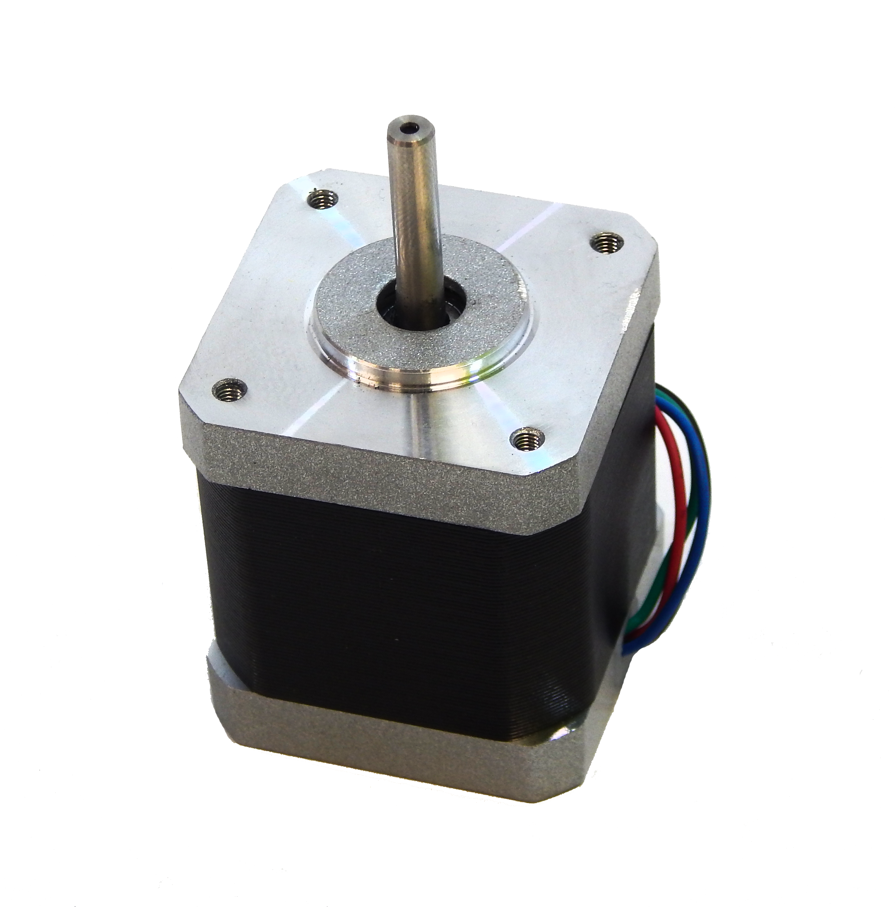

.. _sec-scanner-components-motor:

Motor
=====

Supported motors
----------------

Nema 17
```````



Bipolar stepper motor.

.. list-table::
   :widths: 50 25

   * - **Name**
     - **Value**
   * - Phase
     - 2
   * - Voltage
     - 2.55 V
   * - Step angle
     - 1.8º
   * - Fan angle
     - > 60 º
   * - Shaft height
     - 22 mm
   * - Body height
     - 40 mm
   * - Wire length
     - 600 mm
   * - Chamfer
     - Yes

Gcodes
------

G1
````
Perform an angular movement. Using the F command, the angular speed is set to the specified value in degrees per second. Also with the X command, the motor moves to the specified absolute position in degrees.

:Examples: G1 F200, G1 X-90

G50
````
Reset all positions to zero. It is recommended to be executed after M18 to avoid the oscillation anchor.

M17
````
Enable the motor. It remains enabled even after sending G1 commands.

.. warning::

    If the motor is enabled for a long time, the driver and the motor can overheat and even break.


M18
````
Disable the motor. It remains disabled even after sending G1 commands.

Troubleshooting
---------------

Reversed direction of rotation
``````````````````````````````

   Motor rotation must turn in a counterclockwise direction with positive angles. If it turns in reverse, probably the connector is connected in the wrong way. This can be solved by editing the parameter ``invert_motor`` in Preferences > Invert the motor direction.

Strange movements
`````````````````

   To avoid possible strange movements in the motor:

   1. Make sure the motor step is 1.8º.
   2. Put all the jumpers in the Zum Scan board to enable micro-stepping.
   3. Adjust the electrical current with the potentiometer in the pololu driver. Recommended values are about 200 mA.
