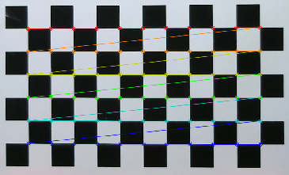

.. _sec-scanner-components-pattern:

Pattern
=======

Supported pattern
-----------------

Chessboard patterns
```````````````````

.. image:: ../_static/scanner-components/chessboard-pattern.svg
   :width: 250 px

.. list-table::
   :widths: 5 3 5

   * - **Name**
     - **Value**
     - **Setting**
   * - Rows
     - 6
     - ``pattern_rows``
   * - Columns
     - 11
     - ``pattern_columns``
   * - Square width
     - 13 mm
     - ``pattern_square_width``
   * - Origin distance
     - > 0.0 mm
     - ``pattern_origin_distance``

.. note::

   These values can be set in *Calibration workbench > Pattern settings*.

.. warning::

   It must be an odd number of columns in order to define an unique origin of the pattern.


Origin distance
---------------

The origin distance is the minimum distance between the origin of the pattern (bottom-left corner) and the pattern's base surface. This value is used to define where is the pattern with respect to the turntable.

.. image:: ../_static/scanner-components/pattern-distance.jpg
   :width: 250 px

Pattern detection
-----------------

When the pattern is correctly detected, the following colored dots and lines are drawn.



Troubleshooting
---------------

Pattern not detected
````````````````````
   If the pattern is not detected:

   1. Check the *Calibration workbench > Pattern settings*.
   2. Improve the environment light conditions.
   3. Adjust the camera settings in *Adjustment workbench > Calibration capture > Pattern*.
