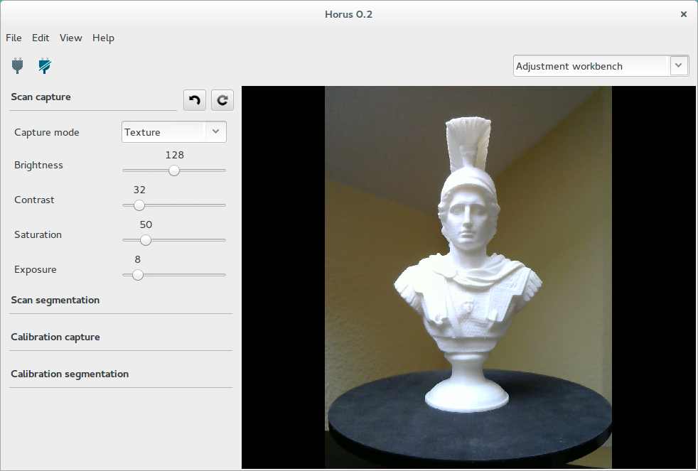
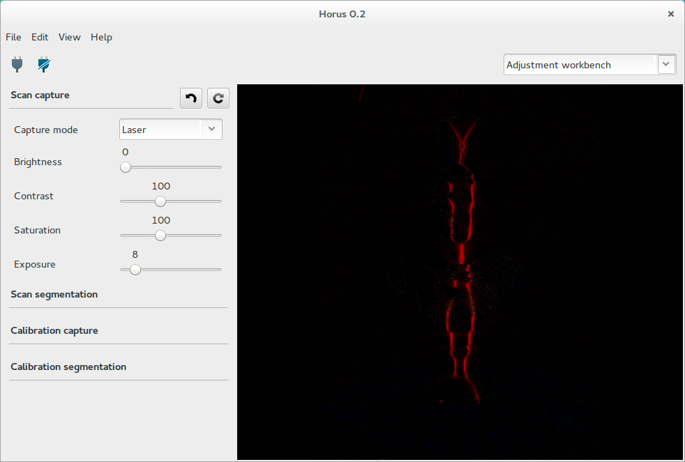
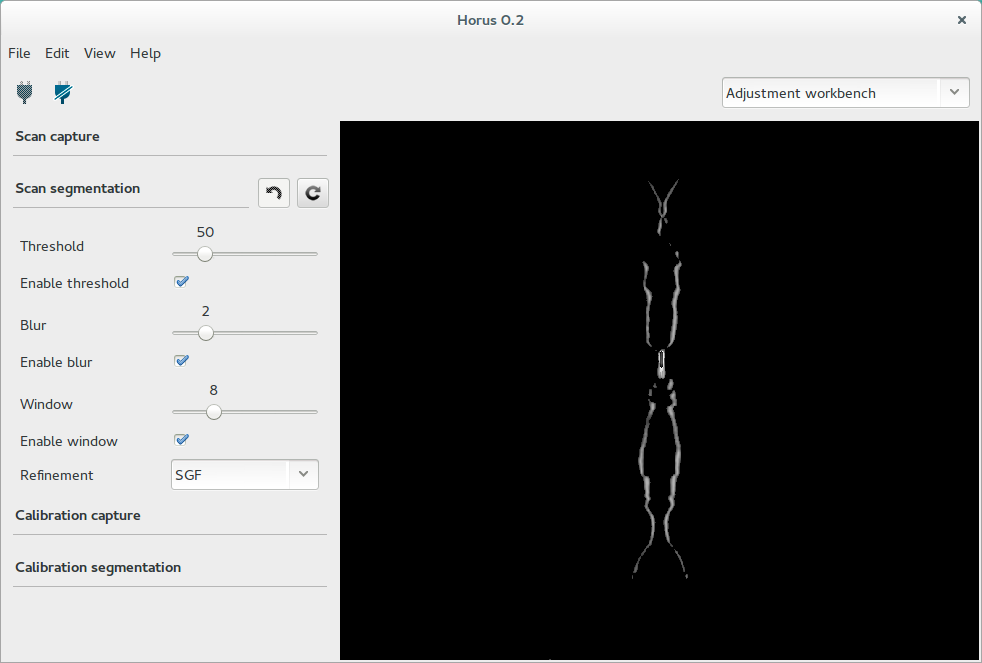
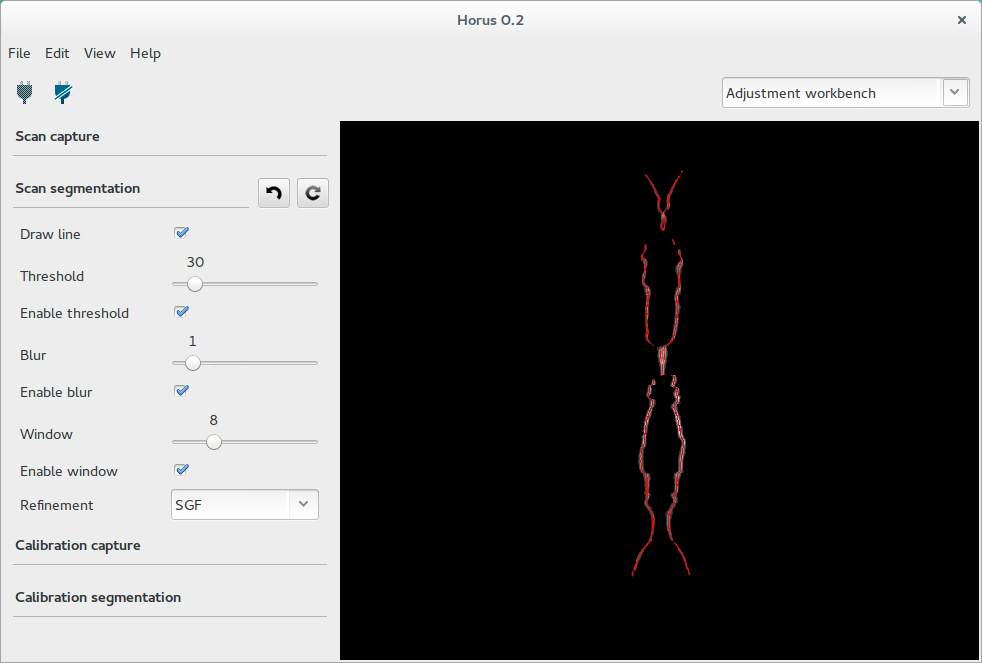
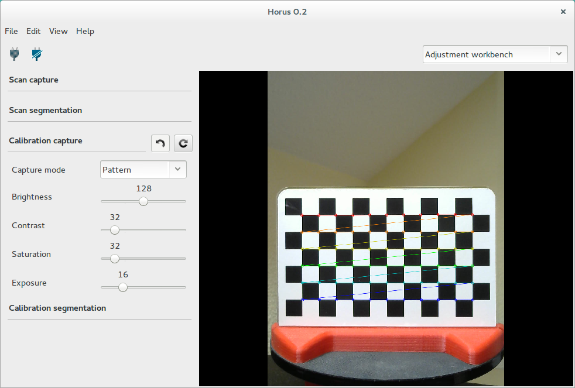
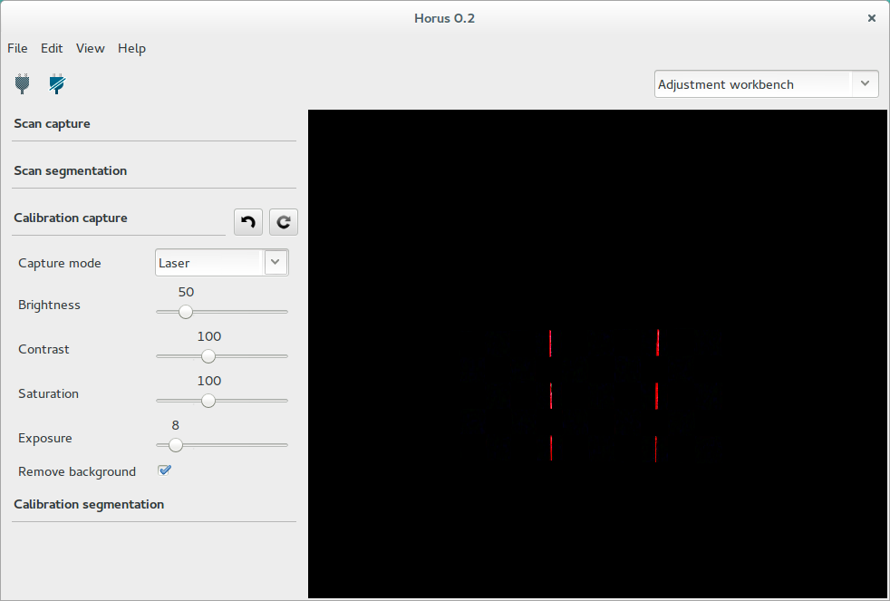

.. _sec-workbenches-adjustment:

Adjustment
==========

In this workbench, camera capture and image processing parameters are adjusted for the different states of the system. The current state and its changes are displayed in the video wall in real time.

Scanning adjustments
--------------------

These settings are applied during the scanning process.

Capture
~~~~~~~

In this section you can adjust the parameters of the capture during the scanning process. These parameters must be adjusted with the object to be scanned.

The *Texture mode* contains the settings used to capture the texture/color of the scanned object. These are: brightness, constrast, saturation and exposure.

The *Laser mode* contains the settings used to capture and detect the laser over the scanned object. These are: brightness, constrast, saturation, exposure and background removal. The *Remove background* option improves the laser detection by consuming twice as long.

Segmentation
~~~~~~~~~~~~

In this section you can adjust the parameters for the laser stripe segmentation during the scanning process.

* **Draw line**: show the computed lines in red from the segmented laser image.
* **Threshold**: remove all pixels which intensity is less that the threshold value.
* **Blur**: blur with Normalized box filter. Kernel size: 2 * value + 1.
* **Window**: filter pixels out of 2 * window value around the intensity peak.
* **Refinement**: apply None or SGF algorithms for line smooth. SGF produces continous surfaces.

Calibration adjustments
-----------------------

These settings are applied during the calibration processes.

Capture
~~~~~~~

In this section you can adjust the parameters of the capture during the calibration process. These parameters must be adjusted with the calibration pattern.

The *Pattern mode* contains the settings used to capture the pattern. These are: brightness, constrast, saturation and exposure.

The *Laser mode* contains the settings used to capture and detect the laser over the pattern. These are: brightness, constrast, saturation, exposure and background removal. The *Remove background* option improves the laser detection by consuming twice as long.

Segmentation
~~~~~~~~~~~~

In this section you can adjust the parameters for the laser stripe segmentation during the calibration processes.

* **Threshold**: remove all pixels which intensity is less that the threshold value.
* **Blur**: blur with Normalized box filter. Kernel size: 2 * value + 1.
* **Window**: filter pixels out of 2 * window value around the intensity peak.
* **Refinement**: apply None, SGF, RANSAC algorithms for line smooth. SGF produces continous surfaces. RANSAC produces flat surfaces.

.. image:: ../_static/workbenches/adjustment-calibration-segmentation.png
