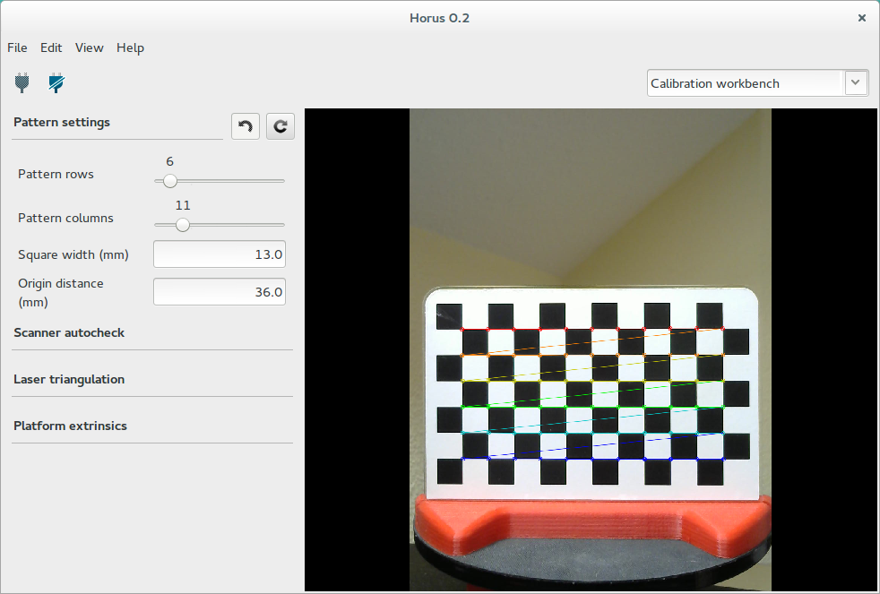
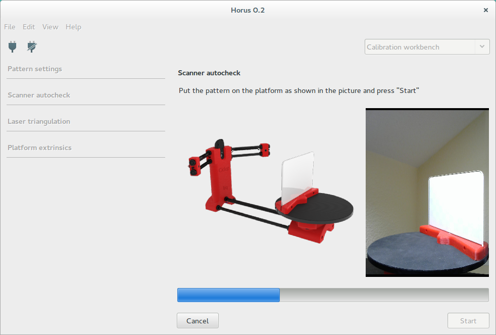
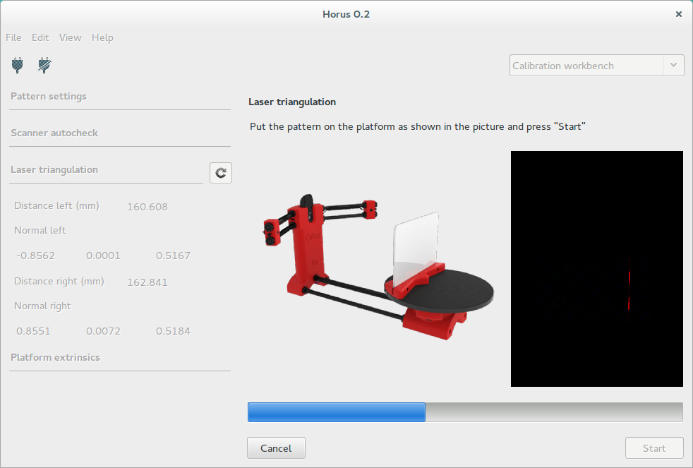
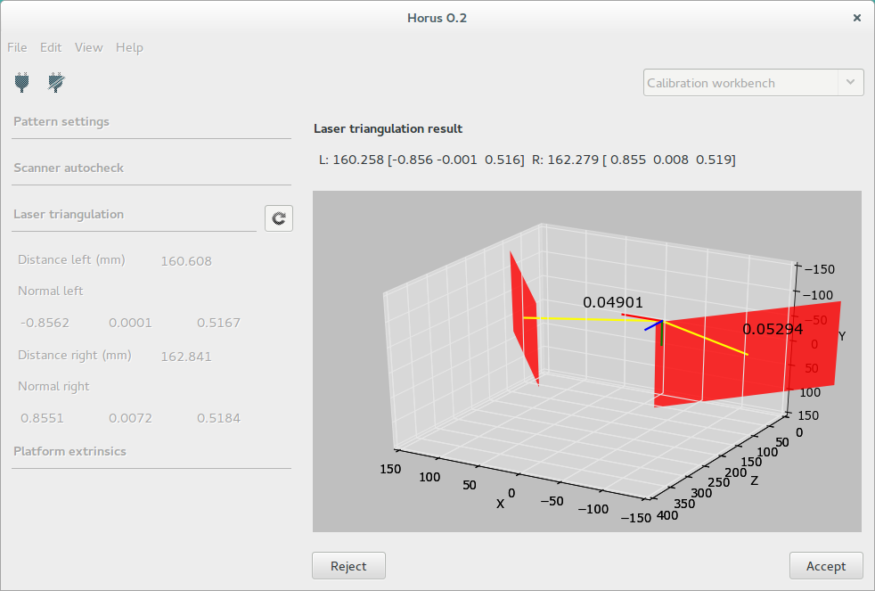
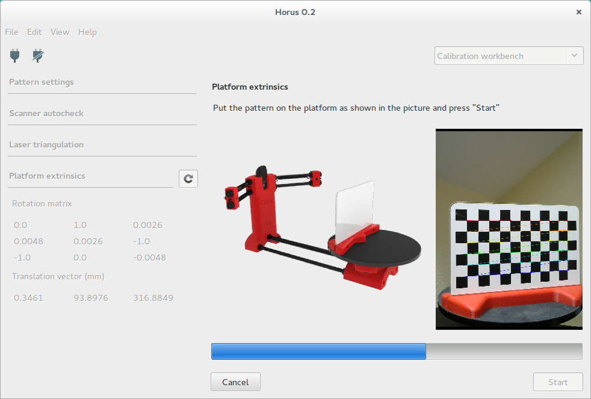
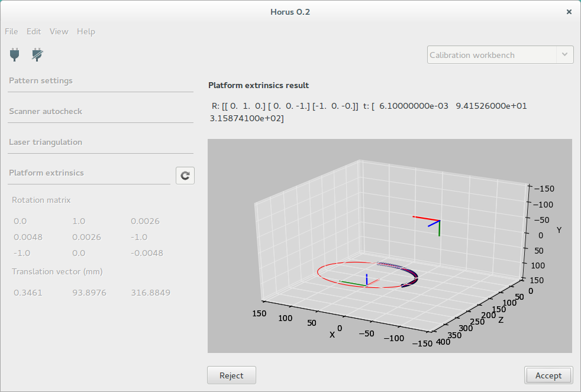
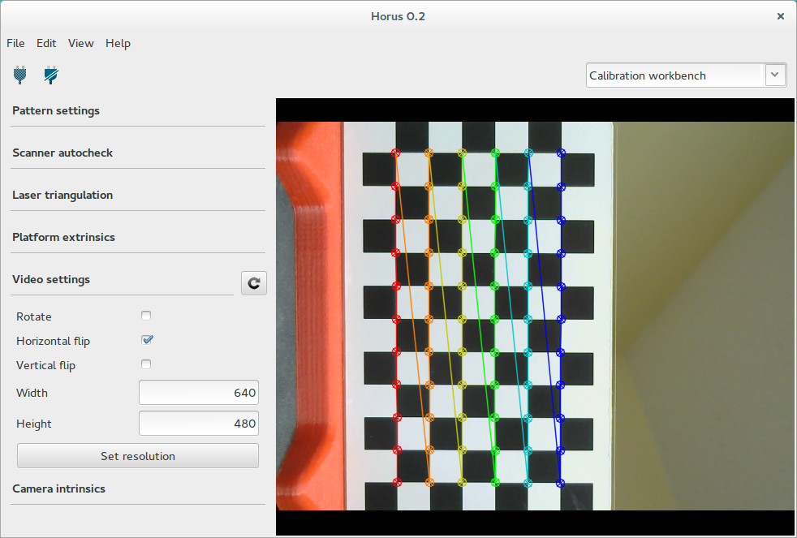
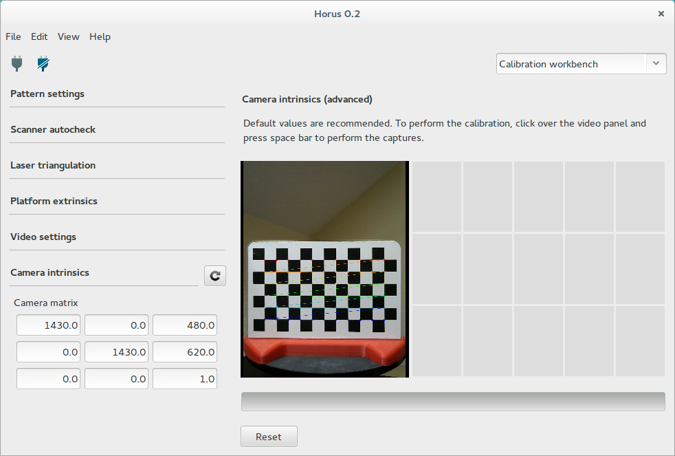

.. _sec-workbenches-calibration:

Calibration
===========

This workbench contains all the scanner calibration processes.

Pattern settings
----------------

This section contains the calibration pattern features:

* **Pattern rows**: number of corner rows in the pattern. Default value 6.
* **Pattern columns**: number of corner columns in the pattern. Default value 11.
* **Square width**: default value 13 mm.
* **Origin distance**: minimum distance between the origin of the pattern (bottom-left corner) and the pattern's base surface in mm. There is no default value because it depends on the physical pattern.

Autocheck
---------

This section contains the auto check process in which is detected whether the pattern, motor and lasers are configured properly.

The pattern should be placed as shown in the picture. If the process ends successfully, the pattern will be placed perpendicular to the camera. Otherwise, a notification will be displayed.

Laser calibration
-----------------

In this section, the laser's planes are calculated. Each plane is defined by a normal vector and the minimum distance from the plane to the optical center of the camera.

To begin the calibration, the pattern must be placed perpendicular to the camera, as shown in the picture. At any time you can cancel the calibration and the pattern will return to its initial position.

Finally the result is shown numerically and depicted in 3D. Also, the dispersion of the captured points during calibration appears. This value must be less than 0.1 mm. You can accept or reject the calibration result.

Platform calibration
--------------------

In this section, the homogeneous transformation matrix from the rotation center of the turntable with respect to the camera system is calculated. This matrix is composed by a rotation matrix and a traslation vector in mm.

To begin the calibration, the pattern must be placed perpendicular to the camera, as shown in the picture. At any time you can cancel the calibration and the pattern will return to its initial position.

Finally the result is shown numerically and depicted in 3D. You can accept or reject the calibration result.

Once this process is completed, the scanner is calibrated.

Video settings (advanced)
-------------------------

This is an advanced section. It contains the rotation flags for the video. Also you can set the camera resolution in px.

.. hint::

   If a wrong resolution is set, the nearest resolution is recommended. Also, you can go back to the latest resolution.

.. note::

   In Mac OS the resolution can not be set in runtime because of its OpenCV version.

Camera calibration (advanced)
-----------------------------

This is an advanced section. Default values are recommended.

To begin the calibration, press the "space" key to capture the pattern in different positions. Once taken all the captures, the calibration starts automatically. You can reset the taken captures at any time.

.. warning::

   If camera intrinsics values are modified, laser and platform calibrations must be performed again.

|

.. note::

   To enable the advanced mode go to the menu *View > Advanced mode*.

   .. image:: ../_static/workbenches/calibration-advanced-mode.png
