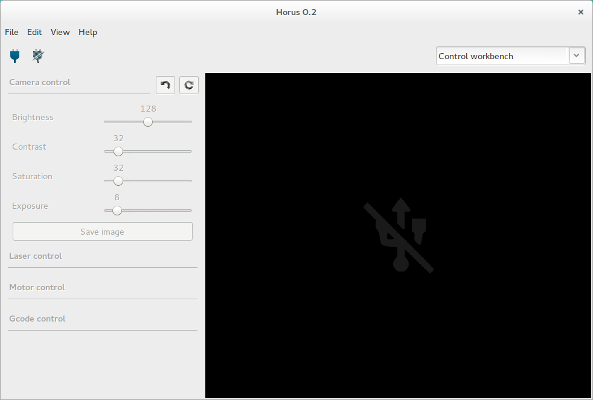
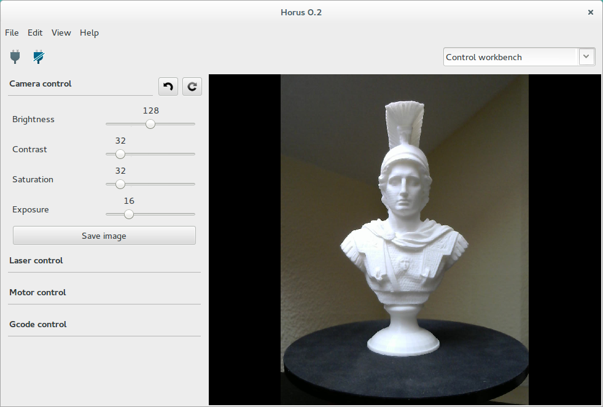
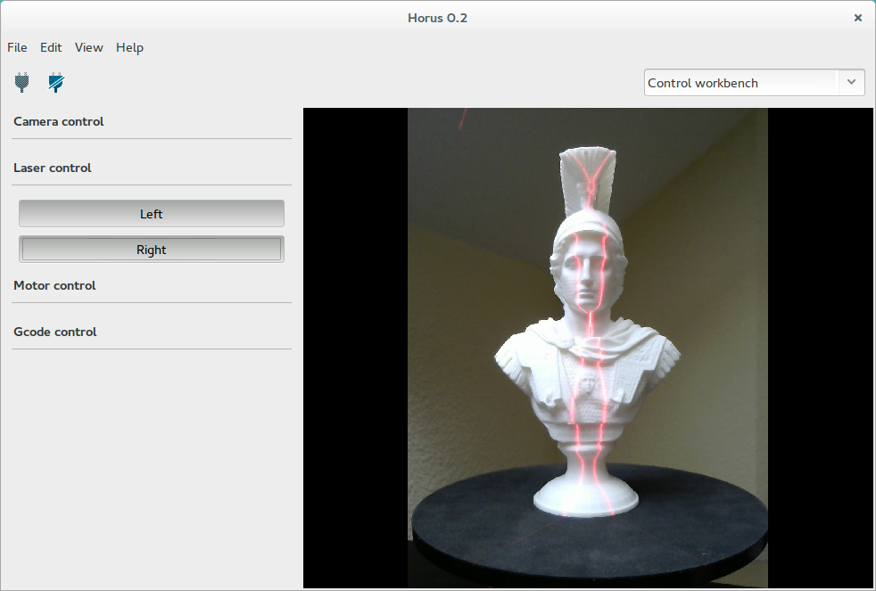
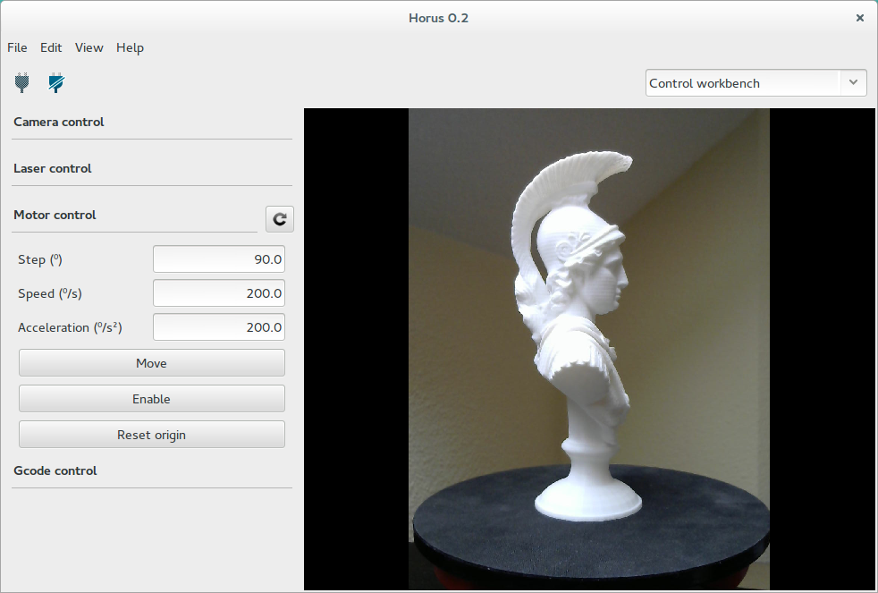
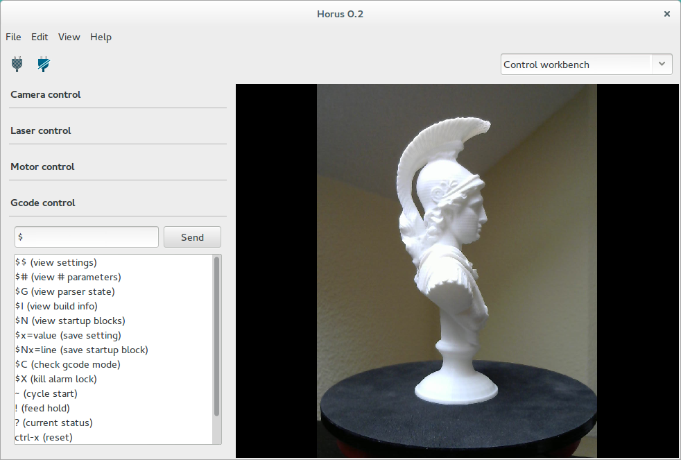

.. _sec-workbenches-control:

Control
=======

This workbench is used to test the scanner components: camera, lasers and motor.

Camera
------

In this section you can adjust the brightness, contrast, saturation and exposure of the camera.

Also it allows to capture and save images from the camera in *png* format.

Laser
-----

In this section you can turn on and off the lasers. When leaving the workbench the lasers are automatically turned off.

Motor
-----

In this section you can move the motor to an absolute angle, with a specific speed and acceleration. These values affect only to this workbench.

Also the motor can be enabled or disabled and the position stored inside the firmware reseted.

Gcode
-----

This section contains a terminal that allows to communicate with the firmware through Gcode commands.

