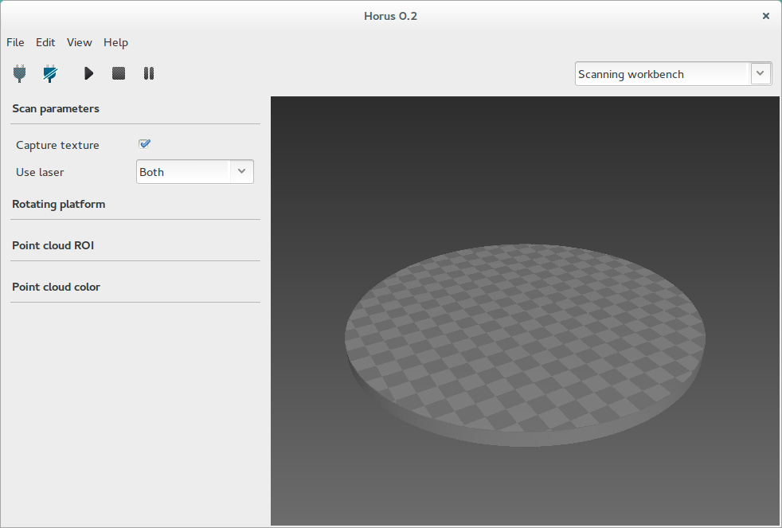
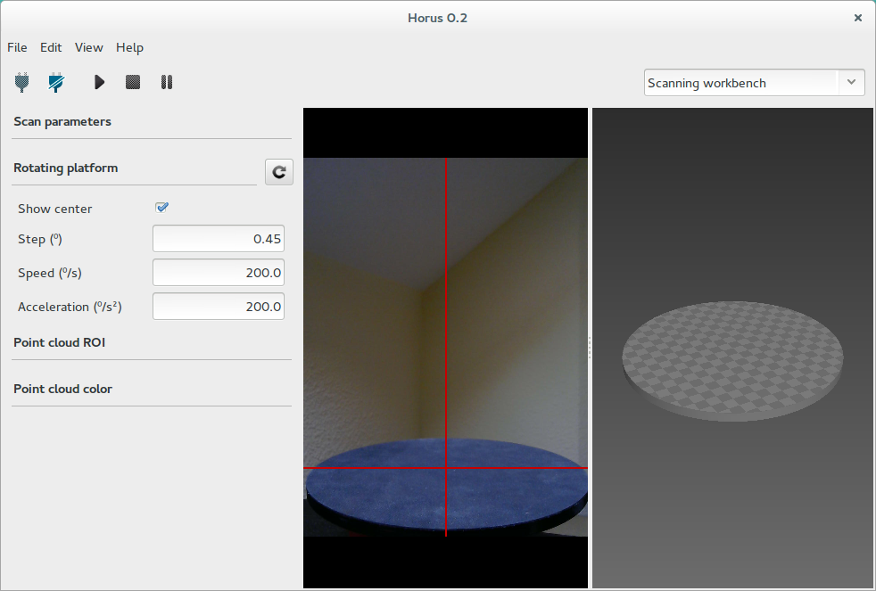
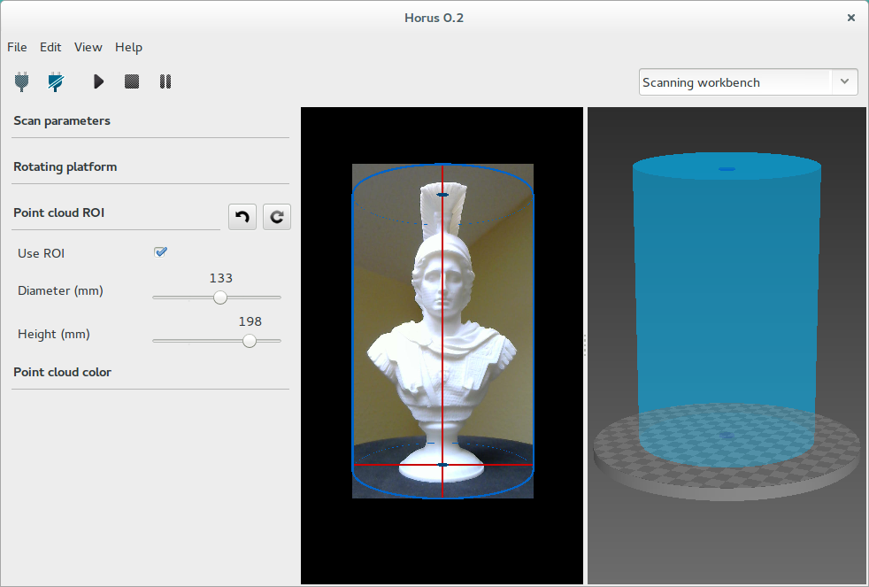
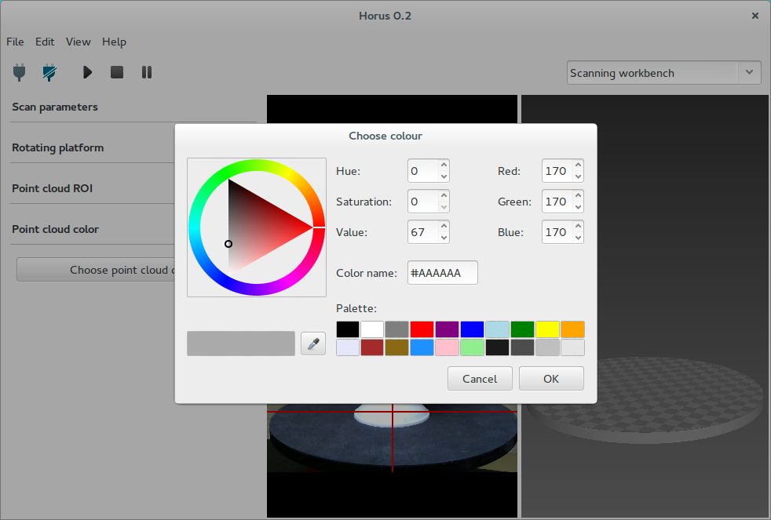

.. _sec-workbenches-scanning:

Scanning
========

This workbench is where the 3D scanning process is performed. This process generates a three dimensional point cloud from a physical object. It has three components:

* Settings panel
* Video wall
* 3D scene

Through the menu *View* these panels can be shown or hidden.

Settings panel
--------------

Scan parameters
~~~~~~~~~~~~~~~

* **Capture texture**: enabling this option captures the real color of the object. Otherwise the point cloud has an uniform fake color. If this option is disabled, the process is faster and the color used is the one defined in the *Point cloud color* section.
* **Use laser**: selects left laser, right laser or both.

Rotating platform
~~~~~~~~~~~~~~~~~

* **Show center**: shows the center of the platform using the current calibration values.
* **Step**: is the angle increased in each scan iteration. The smaller the step, the greater radial resolution, and also more scanning time. The default value is 0.45º, that is 800 steps per revolution.
* **Speed**: is the motor speed in degrees per second. Te default value is 200 º/s.
* **Acceleration**: is the motor acceleration in degress per secon squared. The default value is 200 º/s².

Point cloud ROI
~~~~~~~~~~~~~~~

In this section the ROI (Region of interest) is defined. It is a cylindrical volume in the point cloud and a rectangle in the video.

* **Use ROI**: enabling this option applies the ROI. This region is the one being scanned both in the video and in the point cloud. All information outside won't be taken into account during the scanning process.
* **Diameter**: ROI diameter in mm. The default value is 200 mm.
* **Height**: ROI height in mm. The default value is 200 mm.

Point cloud color
~~~~~~~~~~~~~~~~~

In this section is selected the color for the point cloud when no texture is captured.

|

.. note::

   The *Settings panel* is hidden during the scanning process.

Video wall
----------

In this window, two states are distinguished: while not scanning, it shows the video in texture mode. When the scan starts, you can select several views corresponding to the different stages of the image processing.

* **Texture**

 .. image:: ../_static/workbenches/scanning-video-texture.png

* **Laser**

 .. image:: ../_static/workbenches/scanning-video-laser.png

* **Gray**

 .. image:: ../_static/workbenches/scanning-video-gray.png

3D scene
---------

This section is a three-dimensional scene where the scanned point cloud (model) is shown. Also it allows to view meshes in *stl* format.

To start scanning press the *Play* button. Also the process can be stopped, paused and resumed. During the scanning, the progress is shown in the bottom of the scene.

You can navigate in the 3D scene using the following shortcuts:

.. list-table::
   :widths: 1 1 1

   * - **Action**
     - **Shortcut 1**
     - **Shortcut 2**
   * - Default views
     - Home / PgUp / PgDn / End
     -
   * - Rotate
     - Left click
     - Shift + Up/Down
   * - Rotate horizontally
     - Up / Down
     -
   * - Rotate vertically
     - Left / Right
     -
   * - Vertical shift
     - Ctrl + Mouse wheel
     - Ctrl + Up / Down
   * - Reset vertical shift
     - Dobule left click
     -
   * - Traslation
     - Shift + Left click
     -
   * - Zoom
     - Mouse wheel
     - Shift + Up /Down
   * - Delete object
     - Right click + Delete object
     - Del
   * - Quit program
     - Ctrl + Q
     -

.. image:: ../_static/workbenches/scanning-3d-scene.png

To load, save or reset the 3D model, access from the menu *File*.
